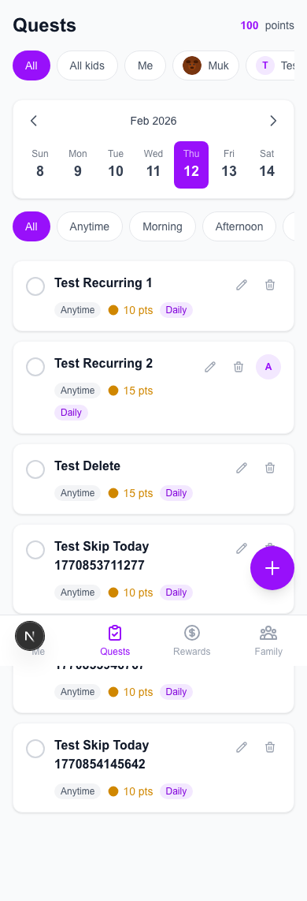
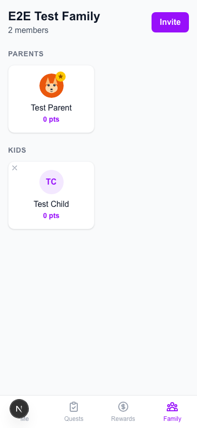
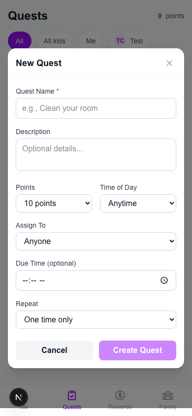
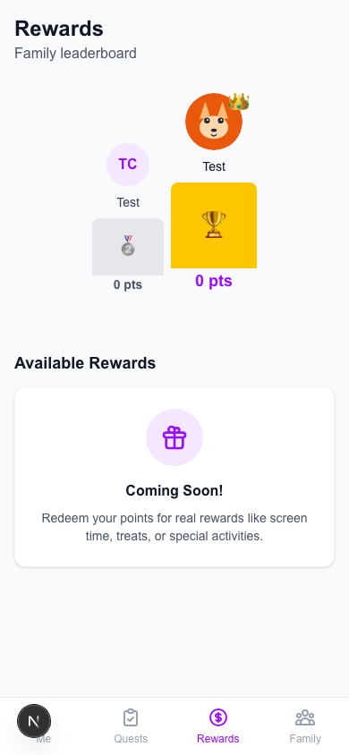
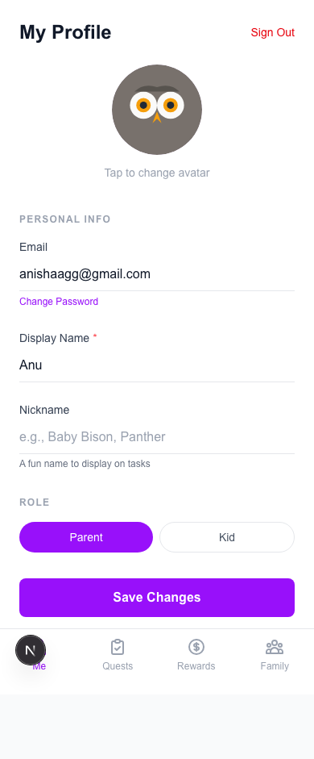
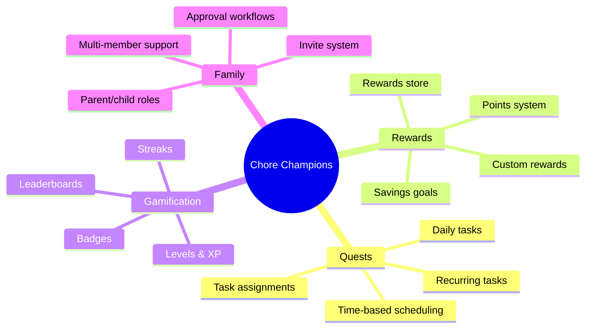
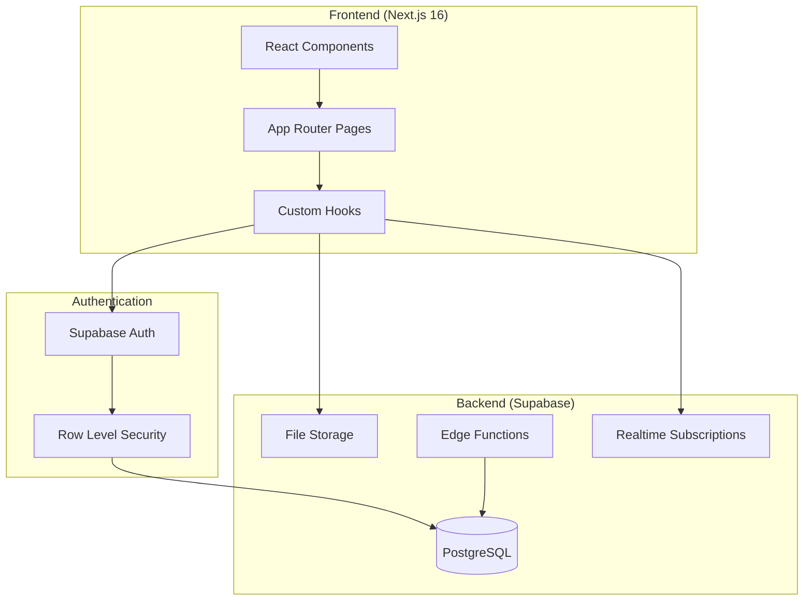
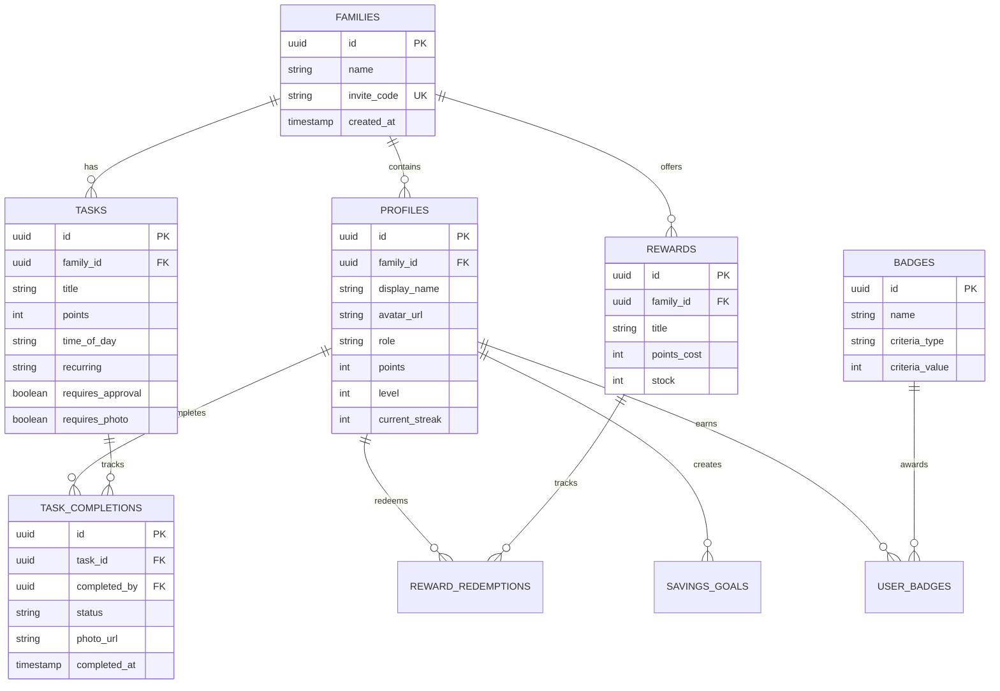
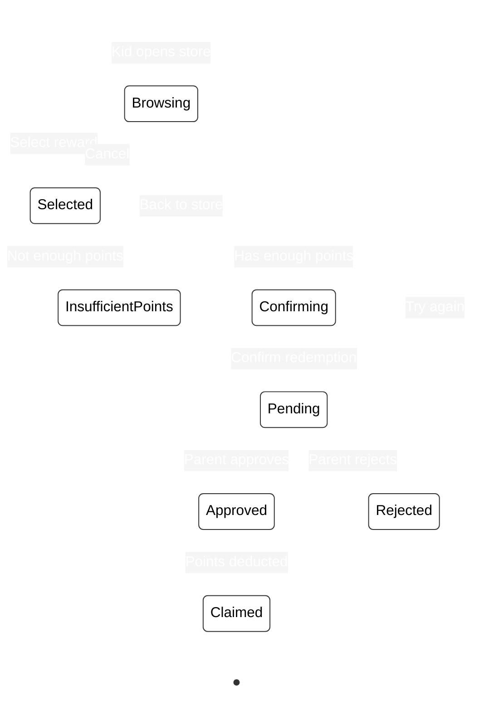

# Chore Champions

A gamified family chore management app where kids earn points, level up, and redeem rewards for completing household tasks.

[](https://github.com/anisha-agarwal/chore-champions/actions)
[](https://github.com/anisha-agarwal/chore-champions/issues)
[](https://github.com/anisha-agarwal/chore-champions/stargazers)


## Screenshots

<table>
  <tr>
    <td align="center"><strong>Landing Page</strong></td>
    <td align="center"><strong>Quests Dashboard</strong></td>
    <td align="center"><strong>Family Management</strong></td>
  </tr>
  <tr>
    <td></td>
    <td></td>
    <td></td>
  </tr>
  <tr>
    <td align="center"><strong>Create Quest</strong></td>
    <td align="center"><strong>Rewards Store</strong></td>
    <td align="center"><strong>Profile</strong></td>
  </tr>
  <tr>
    <td></td>
    <td></td>
    <td></td>
  </tr>
</table>

## Features



## Architecture



## Database Schema



## User Flows

### Task Completion Flow

```mermaid
%%{init: {'theme': 'base', 'themeVariables': {'actorBkg': '#ffffff', 'actorBorder': '#333333', 'actorTextColor': '#000000', 'actorLineColor': '#ffffff', 'signalColor': '#ffffff', 'signalTextColor': '#ffffff', 'labelTextColor': '#ffffff', 'loopTextColor': '#ffffff', 'labelBoxBkgColor': '#555555', 'labelBoxBorderColor': '#ffffff', 'noteBkgColor': '#ffffcc', 'noteTextColor': '#000000', 'noteBorderColor': '#ffffff', 'activationBkgColor': '#f0f0f0', 'activationBorderColor': '#ffffff'}}}%%
sequenceDiagram
    actor Kid
    participant App
    participant DB as Supabase
    actor Parent

    Kid->>App: Complete task

    alt Task requires photo
        App->>Kid: Request photo
        Kid->>App: Upload photo
        App->>DB: Store photo
    end

    alt Task requires approval
        App->>DB: Create pending completion
        DB->>Parent: Notify for approval
        Parent->>App: Review & approve
        App->>DB: Update status to approved
    else No approval needed
        App->>DB: Create approved completion
    end

    DB->>DB: Trigger: Award points
    DB->>DB: Trigger: Check badges
    DB->>DB: Trigger: Update streak
    App->>Kid: Show celebration
```

### Rewards Redemption Flow



## Tech Stack

| Layer | Technology | Purpose |
|-------|------------|---------|
| Framework | Next.js 16 (App Router) | Server & client rendering |
| UI | React 19 + Tailwind v4 | Component library & styling |
| Language | TypeScript 5 | Type safety |
| Database | Supabase (PostgreSQL) | Data persistence |
| Auth | Supabase Auth | Authentication & RLS |
| Storage | Supabase Storage | Photo uploads |
| Testing | Jest + Playwright | Unit & E2E tests |
| CI/CD | GitHub Actions | Automated testing |

## Getting Started

```bash
# Install dependencies
npm install

# Set up environment variables
cp .env.example .env.local
# Add your Supabase credentials

# Run development server
npm run dev

# Run tests
npm test              # Unit tests
npm run test:e2e      # E2E tests
npm run lint          # Linting
```

## Project Structure

```
chore-champions/
├── app/                    # Next.js App Router
│   ├── (auth)/            # Auth pages (login, signup, join)
│   ├── (dashboard)/       # Main app pages
│   │   ├── quests/        # Task management
│   │   ├── rewards/       # Rewards store
│   │   ├── family/        # Family members
│   │   └── me/            # Profile & settings
│   └── auth/              # Auth callbacks
├── components/
│   ├── ui/                # Reusable UI components
│   ├── tasks/             # Task-related components
│   ├── family/            # Family components
│   └── layout/            # Layout components
├── lib/
│   ├── supabase/          # Supabase client
│   ├── types.ts           # TypeScript types
│   └── utils.ts           # Utilities
├── supabase/
│   └── migrations/        # Database migrations
├── e2e/                   # Playwright E2E tests
├── __tests__/             # Jest unit tests
└── docs/
    └── adr/               # Architecture Decision Records
```

## Contributing

1. Create a feature branch from `main`
2. Follow the [ADR process](docs/adr/) for architectural decisions
3. Ensure all tests pass (`npm test && npm run test:e2e`)
4. Create a PR with clear description

## License

MIT
