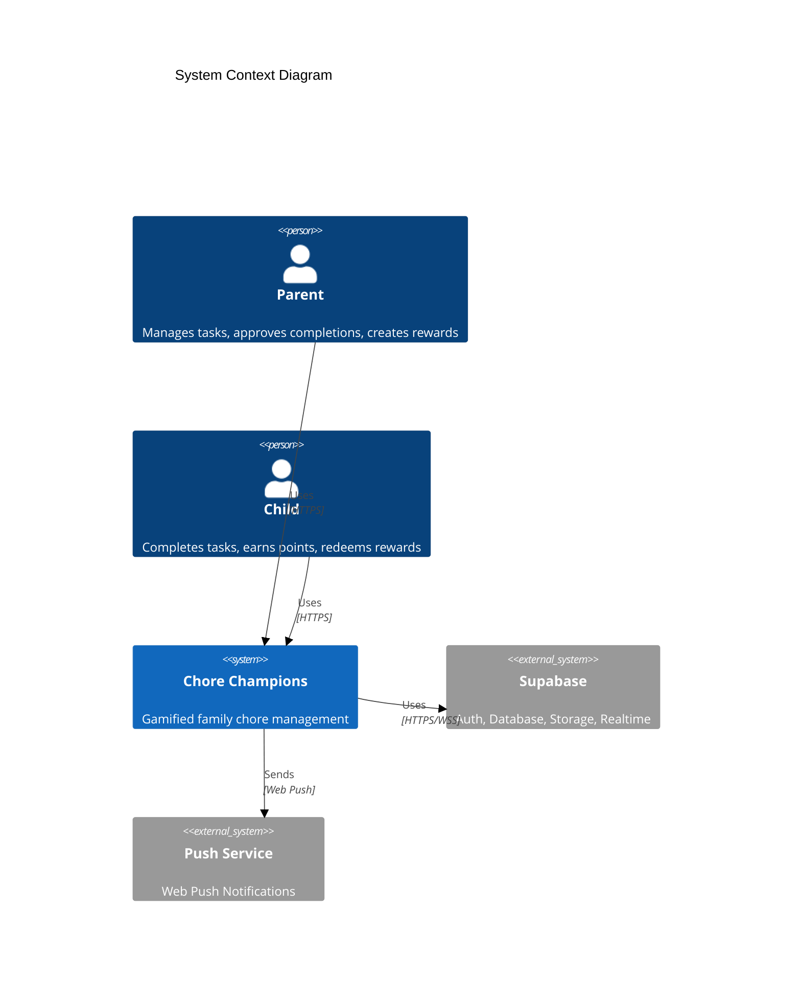
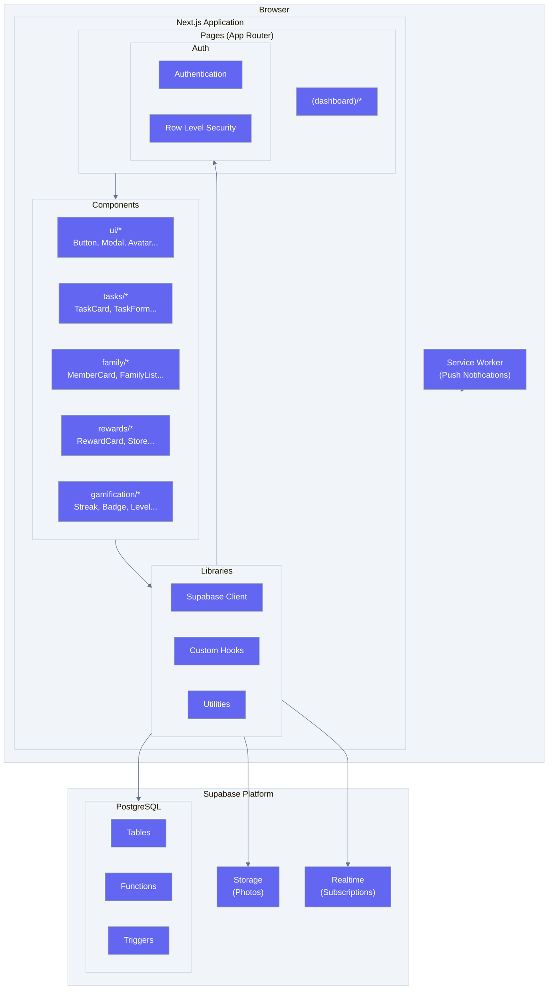
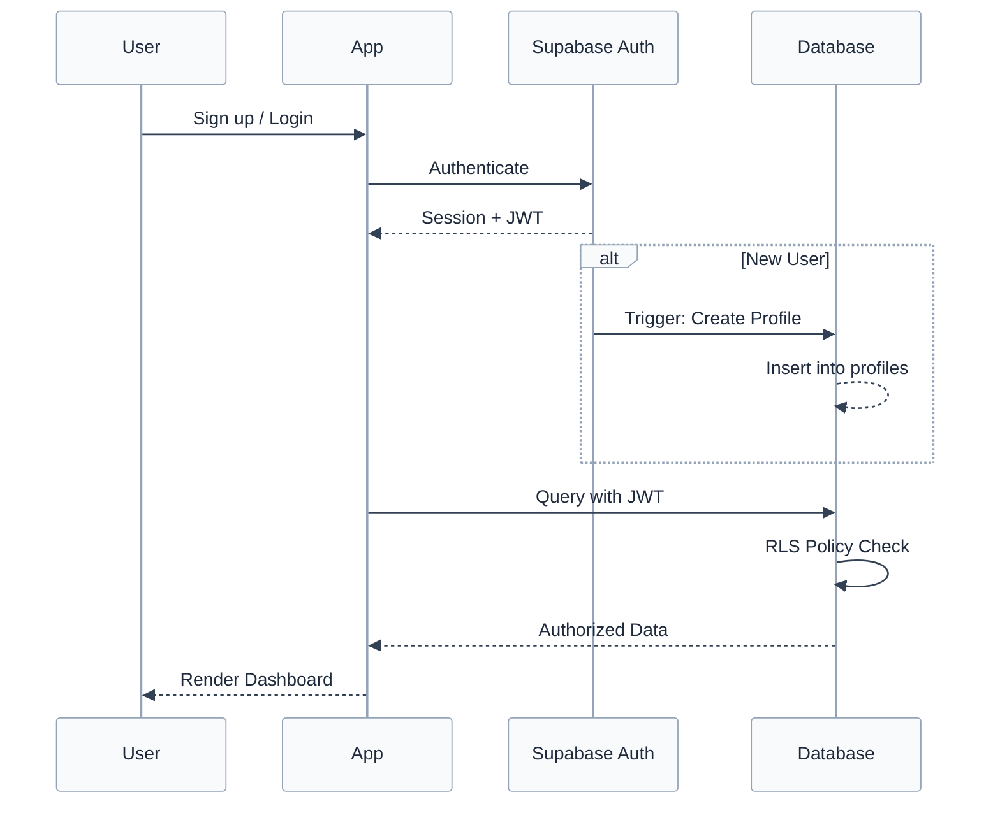
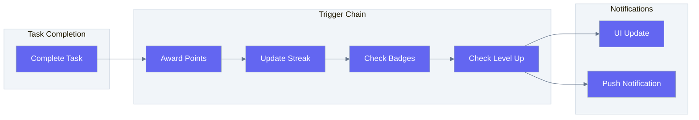
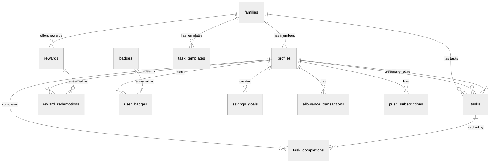
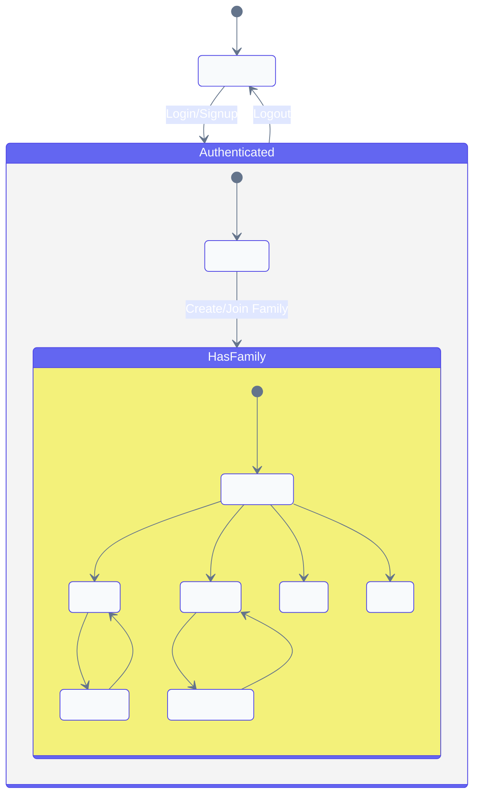
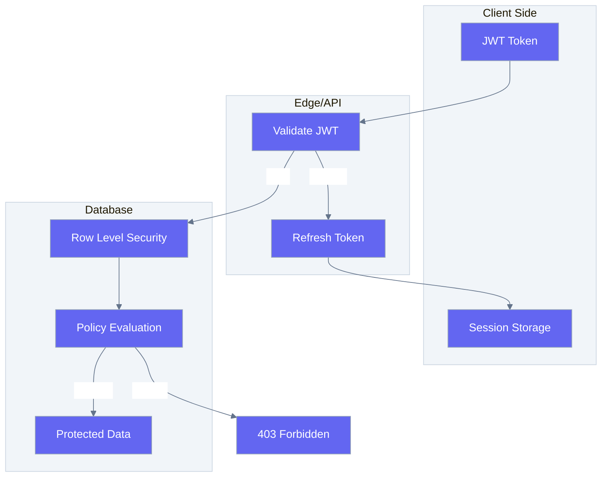
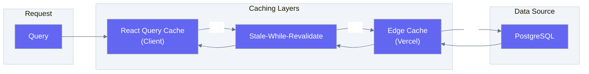
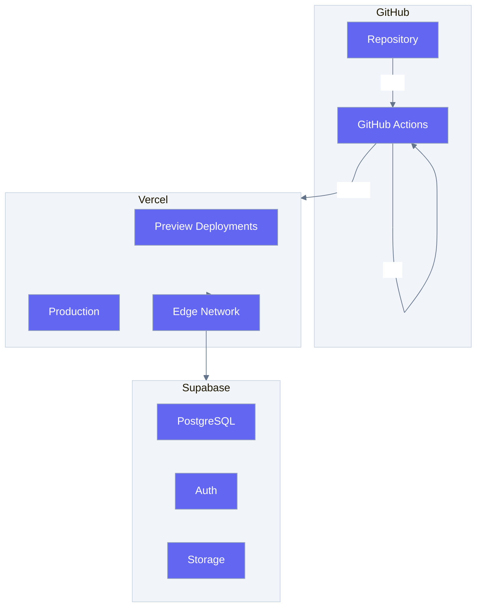

# Architecture Overview

## System Context

## Component Architecture

## Data Flow

### Authentication Flow

### Points & Gamification Flow

## Database Architecture

### Table Relationships

### RLS Policy Matrix

| Table | SELECT | INSERT | UPDATE | DELETE |
|-------|--------|--------|--------|--------|
| families | Own family | Anyone | Parents only | - |
| profiles | Family members | Own profile | Own profile | - |
| tasks | Family tasks | Family members | Family members | Parents + Creator |
| task_completions | Family completions | Family members | Parents (approval) | Parents |
| rewards | Family rewards | Parents | Parents | Parents |
| reward_redemptions | Family redemptions | Family members | Parents | Parents |

## State Management

## Security Model

## Performance Considerations

### Caching Strategy

### Query Optimization

| Query Pattern | Optimization |
|--------------|--------------|
| Family tasks | Index on `family_id` + `due_date` |
| User completions | Index on `completed_by` + `completed_at` |
| Leaderboard | Materialized view with periodic refresh |
| Badge progress | Cached aggregations |

## Deployment Architecture

