# Feature Documentation

## Feature Overview

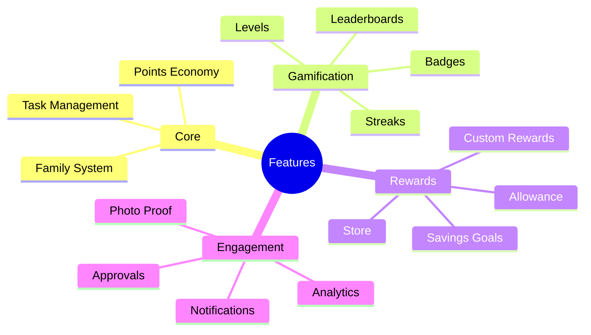

## Gamification System

### Streaks

Track consecutive days of completing all assigned tasks.

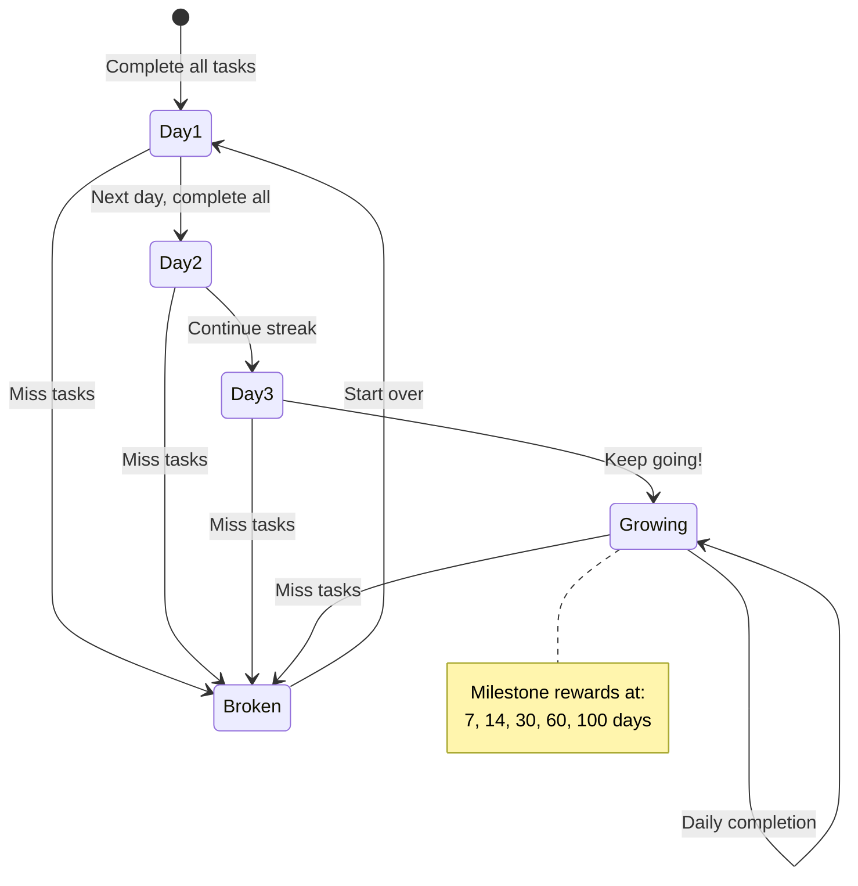

**Streak Milestones:**
| Days | Badge | Bonus Points |
|------|-------|--------------|
| 7 | Week Warrior | +50 |
| 14 | Fortnight Fighter | +100 |
| 30 | Monthly Master | +250 |
| 60 | Dedication Star | +500 |
| 100 | Century Champion | +1000 |

### Levels & XP

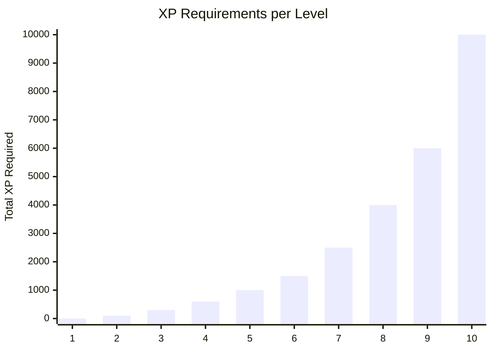

**Level Progression:**

| Level | Title | XP Required | Unlocks |
|-------|-------|-------------|---------|
| 1 | Rookie | 0 | Basic avatars |
| 2 | Helper | 100 | 2 new avatars |
| 3 | Champion | 300 | Custom colors |
| 4 | Star | 600 | Animated avatar |
| 5 | Hero | 1000 | Profile badge |
| 6 | Legend | 1500 | Special effects |
| 7 | Master | 2500 | Exclusive avatar |
| 8 | Elite | 4000 | Title customization |
| 9 | Ultimate | 6000 | Legendary frame |
| 10 | Champion | 10000 | Everything unlocked |

### Badge System

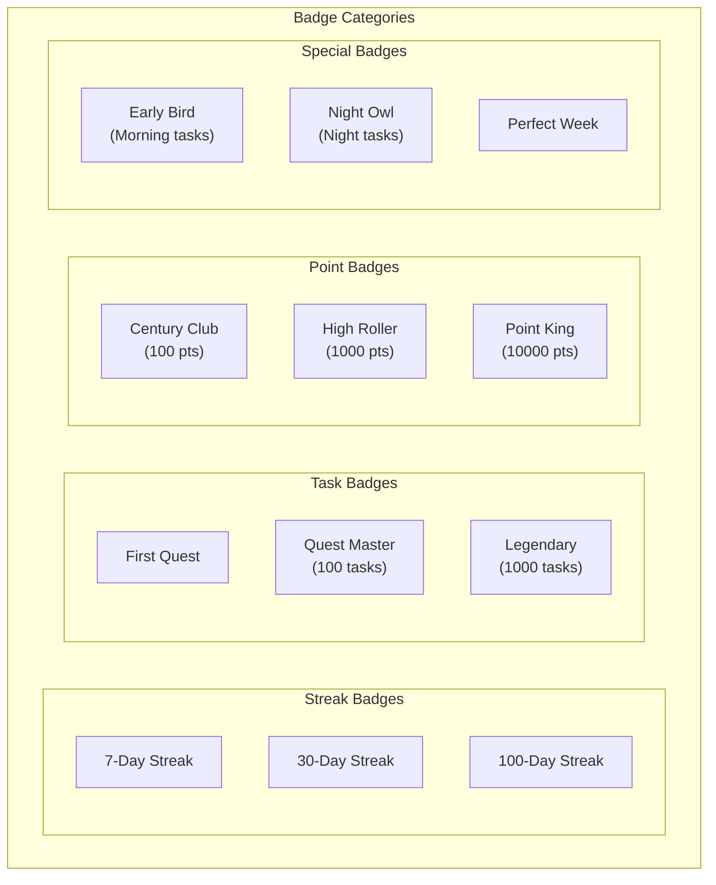

### Leaderboard

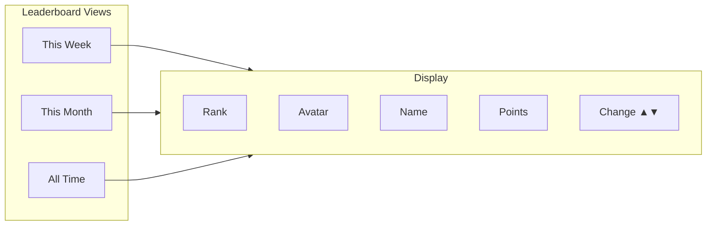

## Rewards System

### Reward Lifecycle

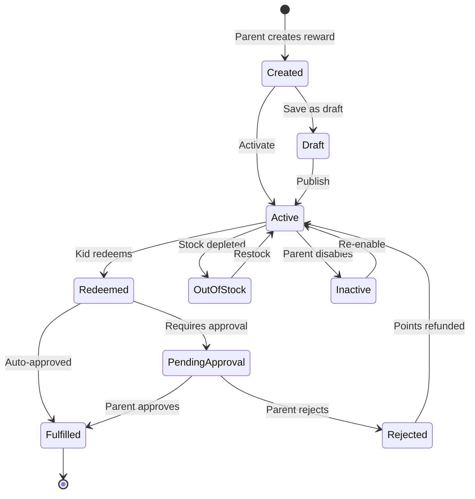

### Savings Goals

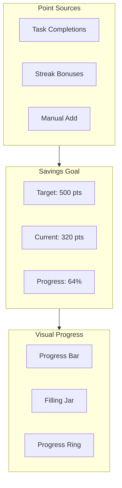

### Allowance Flow

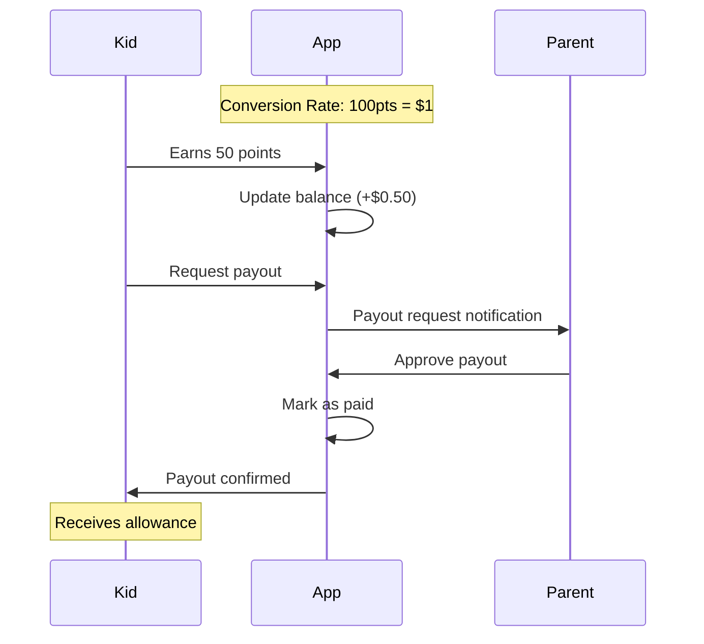

## Task Management

### Task States

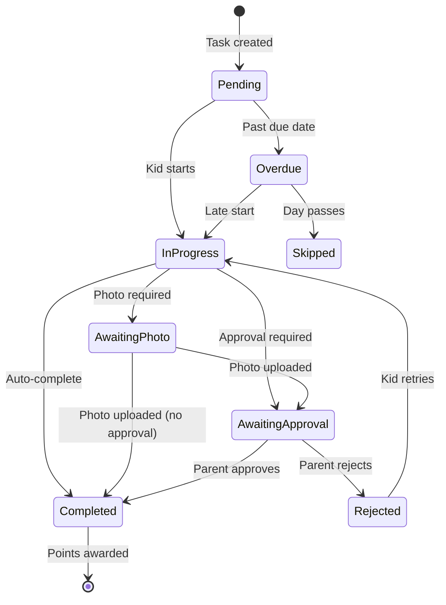

### Recurring Tasks

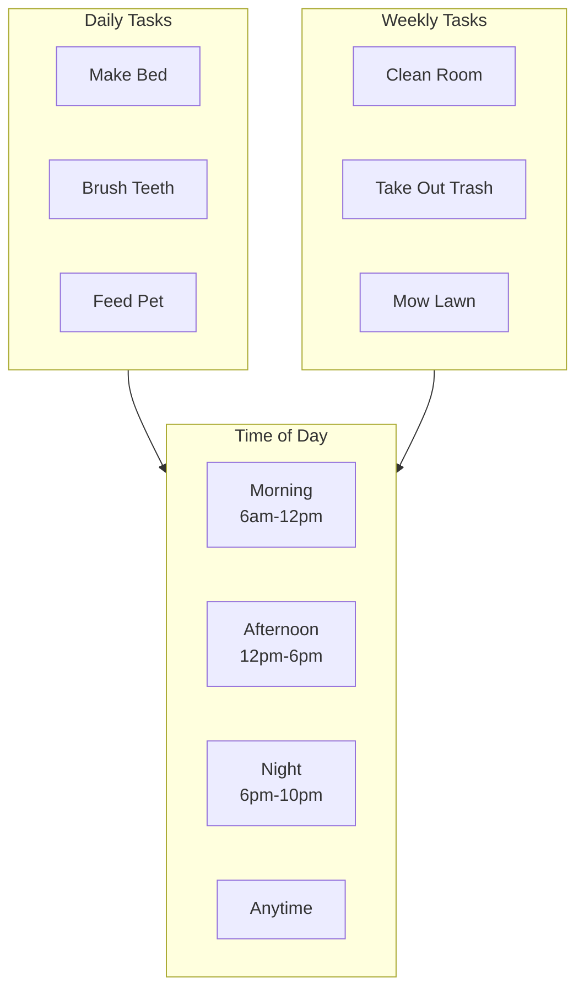

## Analytics Dashboard

### Parent Analytics

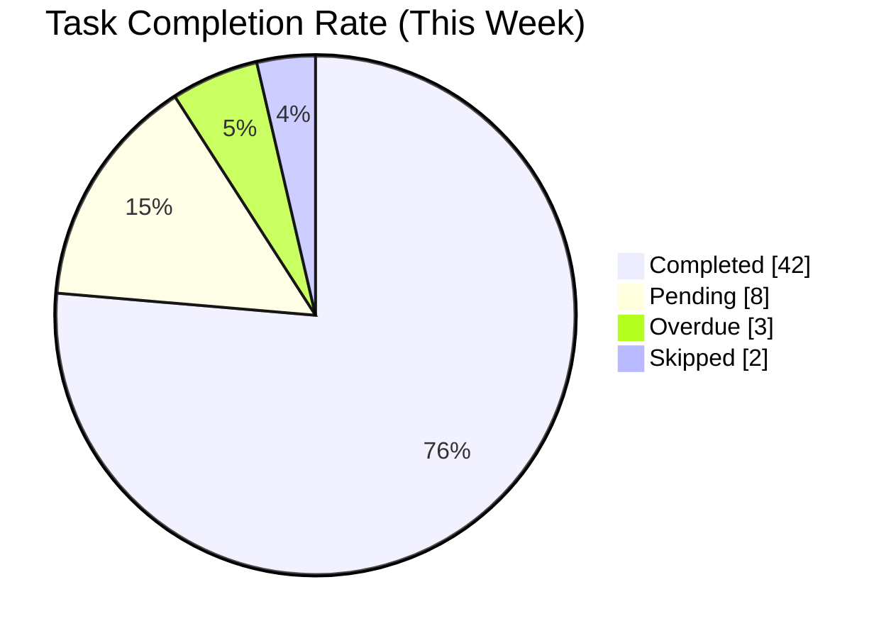

### Kid Analytics

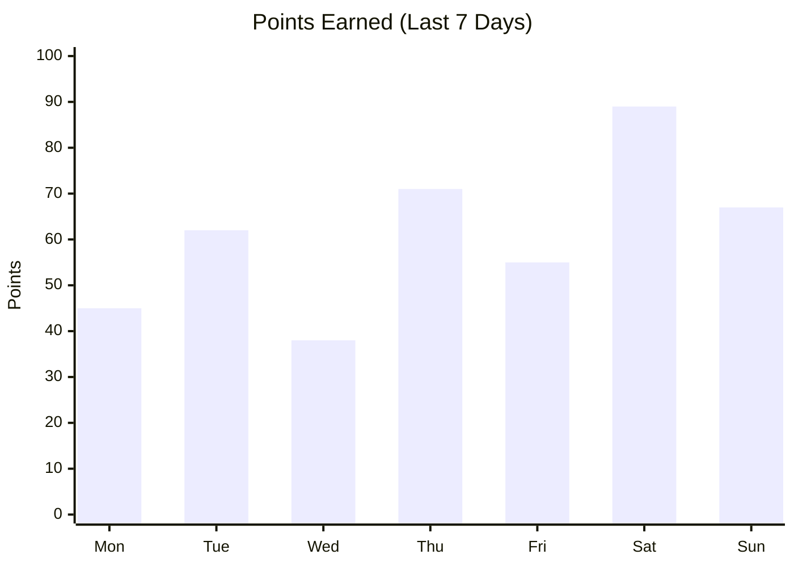

### Activity Heatmap

```
Contribution-style calendar showing daily activity:

     Mon Tue Wed Thu Fri Sat Sun
W1   ███ ███ ░░░ ███ ███ ███ ███
W2   ███ ███ ███ ███ ░░░ ███ ███
W3   ███ ███ ███ ███ ███ ███ ███
W4   ███ ░░░ ███ ███ ███ ███ ███

███ = All tasks completed
▓▓▓ = Partial completion
░░░ = No tasks completed
```

## Notification System

### Notification Types

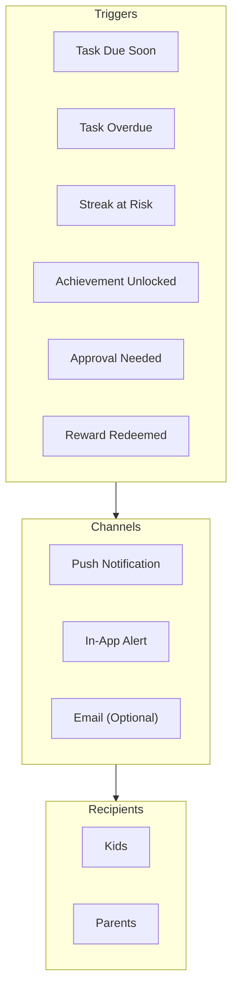

### Notification Schedule

| Event | When | Who |
|-------|------|-----|
| Morning tasks reminder | 7:00 AM | Kids |
| Afternoon tasks reminder | 12:00 PM | Kids |
| Evening tasks reminder | 6:00 PM | Kids |
| Streak at risk | 8:00 PM | Kids |
| Overdue tasks | 9:00 PM | Kids + Parents |
| Approval pending | Immediate | Parents |
| Weekly summary | Sunday 8:00 PM | Parents |
