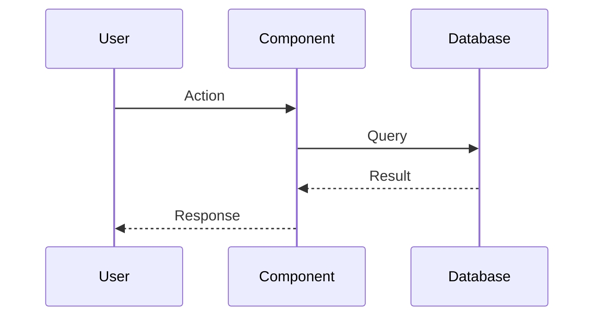

# ADR-NNN: Feature Name

**Status:** Proposed | Accepted | Deprecated | Superseded
**Issue:** #NNN
**Date:** YYYY-MM-DD

## Context

What is the problem or requirement? Why are we making this decision?

## Decision

What did we decide to do? Include key design choices.

## Consequences

### Positive
- Benefit 1
- Benefit 2

### Negative
- Trade-off 1
- Trade-off 2

## Diagram

## Implementation

Key files and changes:
- `path/to/file.tsx` - Description of change
