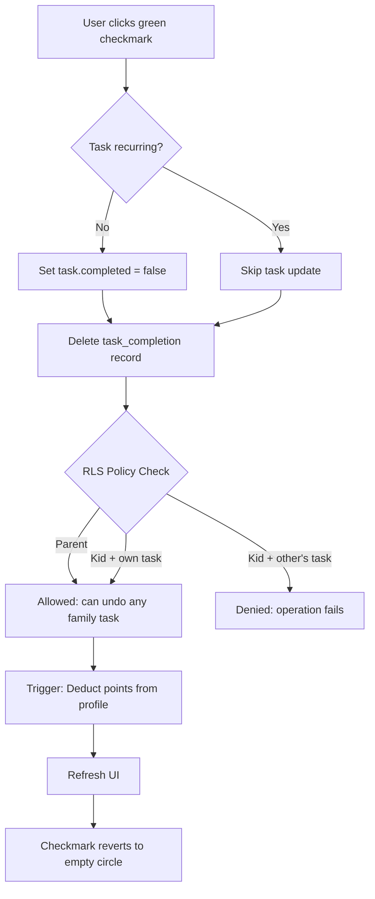

# ADR-001: Undo Task

**Status:** Accepted
**Issue:** #7
**Date:** 2026-02-09

## Context

Users need the ability to undo task completions when they accidentally mark a task as done, or when circumstances change. Currently, once a task is marked complete, there's no way to revert it.

Key requirements:
- Allow undoing task completions
- Deduct points when undoing
- Consider permission model for family members

## Decision

### Permission Model
- **No time limit** on undoing completions
- **Parents can undo any** family member's completions (full oversight)
- **Kids can only undo their own** completions (prevents gaming the system)

### Database Approach
- Use **RLS (Row Level Security) policy** on `task_completions` table for DELETE operations
- Create a **database trigger** to automatically deduct points when a completion is deleted
- Points floor at 0 (never go negative) using `GREATEST(points - OLD.points_earned, 0)`

### UI Approach
- **Clickable green checkmark** - no separate undo button
- **Hover hint** with `title="Click to undo"` for discoverability
- **Spinner state** during uncomplete operation (same as complete)
- Edit button **reappears** after uncompleting

### Recurring vs Non-Recurring Tasks
- **Non-recurring:** Set `tasks.completed = false` AND delete `task_completions` record
- **Recurring:** Only delete `task_completions` record matching `task_id` AND `completion_date` (task row stays unchanged since it can be completed on other days)

## Consequences

### Positive
- Simple, intuitive UI (click checkmark to toggle)
- Consistent with common UX patterns (undo by clicking again)
- Database trigger ensures points are always correctly deducted
- RLS policy enforces permissions at database level (secure)

### Negative
- No undo confirmation dialog (could add later if users accidentally undo)
- No audit trail of undo actions (only completion records exist while active)
- Parents have full control which may not suit all family dynamics

## Diagram

## Implementation

Key files:
- `supabase/migrations/004_deduct_points_on_delete.sql` - RLS policy + trigger
- `components/tasks/task-card.tsx` - Added `onUncomplete` prop and click handler
- `components/tasks/task-list.tsx` - Pass through `onUncomplete` prop
- `app/(dashboard)/quests/page.tsx` - `handleUncompleteTask` function
- `__tests__/components/tasks/task-card.test.tsx` - Unit tests for undo
