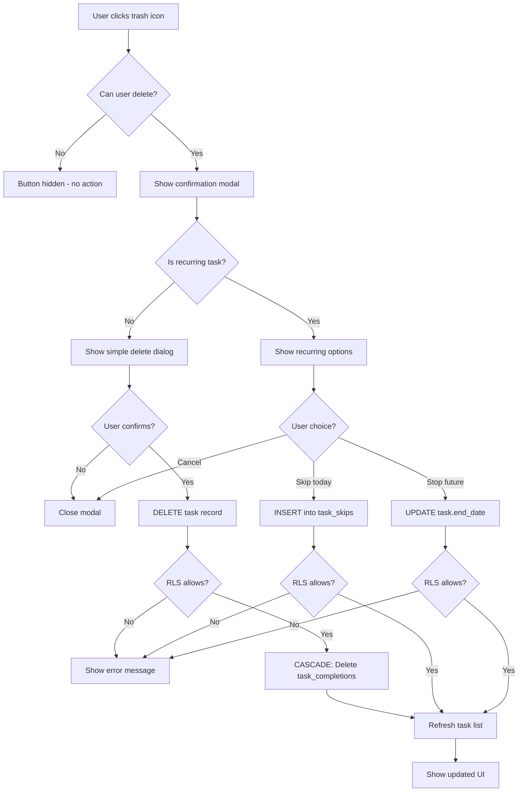

# ADR-002: Delete Task

**Status:** Accepted
**Issue:** #5
**Date:** 2026-02-10

## Context

Users need the ability to delete tasks that are no longer needed to keep their quest list clean. Currently, there's no way to remove a task once created.

Key considerations:
- Permission model: who can delete which tasks?
- Confirmation to prevent accidental deletions
- Handling of completed tasks
- Handling of recurring tasks and their completion history
- Database cascading behavior

## Decision

### Permission Model

**Parents** have full control:
- Can delete any task in their family
- Can skip any recurring task
- Can stop any recurring task

**Kids** have limited control:
- Can only delete tasks they created
- Can only skip recurring tasks they created
- Can only stop recurring tasks they created

Enforced at two levels:
1. **RLS (Row Level Security)** - Database-level enforcement
2. **UI** - Hide actions the user cannot perform

### Completed Tasks
- **Allow deleting completed tasks** - users may want to remove old/obsolete tasks
- Deleting a completed task also removes its completion records (cascade)
- Points already earned are **not deducted** (the work was done)

### Recurring Tasks
For recurring tasks, users have three options:

1. **Skip today** - Hides the task for the selected date only
   - Creates a record in `task_skips` table
   - Task appears again on future occurrences
   - No points affected

2. **Stop all future occurrences** - Ends the recurring schedule
   - Sets `end_date` on the task to yesterday
   - Task stops appearing from today onwards
   - Past completions and points are preserved

3. **Cancel** - Dismiss the modal without action

This approach preserves completion history and earned points while giving users flexible control.

### UI Approach
- **Trash icon button** on TaskCard (next to edit button)
- **Delete button only visible** if user has permission (parent OR created the task)
- **Confirmation modal** before any action
- For **non-recurring tasks**: Simple confirm/cancel dialog
- For **recurring tasks**: Three options (Skip today, Stop future, Cancel)
- **Error message** displayed in modal if RLS blocks an operation

### Database Approach

#### RLS Policies for DELETE on `tasks`:
- Parents can delete any task in their family
- Kids can only delete tasks they created

#### RLS Policies for UPDATE on `tasks`:
- Parents can update any task in their family
- Kids can only update tasks they created

#### RLS Policies for INSERT on `task_skips`:
- Parents can skip any task in their family
- Kids can only skip tasks they created

#### Schema Changes:
- `end_date` column on `tasks` table for ending recurring tasks
- `task_skips` table for tracking skipped dates

## Consequences

### Positive
- Clean, simple UI with familiar trash icon
- Confirmation prevents accidental deletions
- RLS policy enforces permissions at database level
- UI hides actions user cannot perform (better UX)
- Error messages provide feedback if RLS blocks operation
- Recurring task handling preserves history and points
- Flexible options for users (skip one day vs stop entirely)
- Kids cannot delete/modify chores assigned by parents

### Negative
- No soft delete / recovery option for non-recurring tasks (permanent deletion)
- Additional database table and column for recurring task management
- Slightly more complex UI flow for recurring tasks

## Diagram

## Permission Matrix

| Action | Parent | Kid (own task) | Kid (other's task) |
|--------|--------|----------------|-------------------|
| See delete button | ✅ | ✅ | ❌ |
| Delete one-time task | ✅ | ✅ | ❌ |
| Skip recurring task | ✅ | ✅ | ❌ |
| Stop recurring task | ✅ | ✅ | ❌ |

## Implementation

### Migrations:
- `005_delete_task_policy.sql` - RLS policy for kid task deletion
- `006_recurring_task_management.sql` - task_skips table and end_date column
- `007_restrict_task_modifications.sql` - RLS policies for update and skip operations

### Components:
- `components/tasks/task-card.tsx` - Delete button with permission check (`canDelete`)
- `components/tasks/task-list.tsx` - Pass through currentUser for permission checks
- `app/(dashboard)/quests/page.tsx` - Delete handlers, error state, conditional modal UI

### Tests:
- `__tests__/components/tasks/task-card.test.tsx` - Unit tests for delete button visibility
- `e2e/quests.spec.ts` - E2E tests for delete flows
