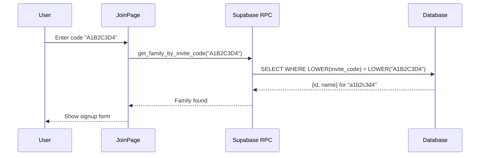

# ADR-003: Case-Insensitive Invite Code Lookup

**Status:** Accepted
**Issue:** #4
**Date:** 2026-02-12

## Context

Users were unable to join families using invite codes entered manually. The error "Invalid or expired invite code" appeared even with valid codes.

**Root cause:** Case sensitivity mismatch
- Database generates lowercase invite codes via `md5()` (e.g., `a1b2c3d4`)
- UI converts user input to uppercase for display (e.g., `A1B2C3D4`)
- PostgreSQL string comparison is case-sensitive by default

## Decision

Make the `get_family_by_invite_code` database function case-insensitive by using `LOWER()` on both sides of the comparison.

```sql
WHERE LOWER(invite_code) = LOWER(code)
```

This approach was chosen over:
1. **Removing uppercase in UI** — Poor UX, codes look better uppercase
2. **Storing codes as uppercase** — Would require data migration

## Consequences

### Positive
- Invite codes work regardless of how users type them
- No UI changes needed
- Backward compatible with existing codes

### Negative
- Slightly slower lookup (negligible with index)

## Diagram



## Implementation

- `supabase/migrations/008_fix_invite_code_case.sql` — Update function with case-insensitive comparison
