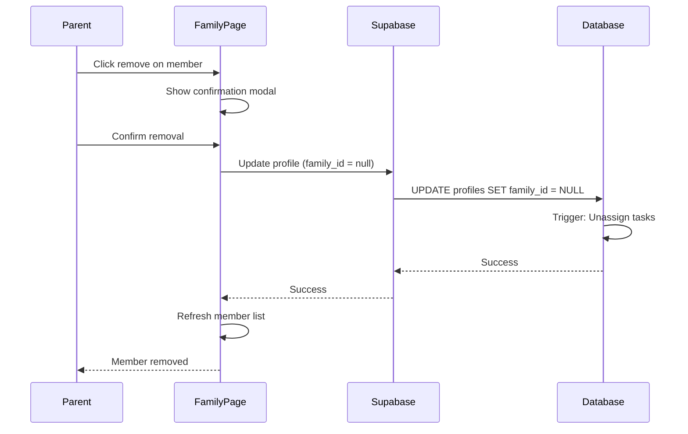

# ADR-004: Remove Family Member

**Status:** Accepted
**Issue:** #8
**Date:** 2026-02-12

## Context

Parents need the ability to remove family members who no longer need access to the family's quests and data.

**Considerations:**
- Only parents should be able to remove members
- Parents cannot remove themselves (prevents orphaned families)
- Tasks assigned to removed members need handling
- Completion history should be preserved

## Decision

### Permissions
- Only parents can remove family members
- Parents can remove other parents (but not themselves)
- Parents can remove children
- Children cannot remove anyone

### Removal Process
1. Set removed user's `family_id` to `null`
2. Unassign all tasks assigned to that user (set `assigned_to` to `null`)
3. Preserve task completion history (points already earned stay)

### UI
- Add remove button (X icon) on member cards
- Only visible to parents
- Hidden on current user's own card
- Confirmation modal before removal

## Consequences

### Positive
- Clean family management
- Removed users retain their account (can join another family)
- Historical data preserved for analytics

### Negative
- Removed users lose access immediately
- Unassigned tasks need manual reassignment

## Diagram

## Implementation

- `supabase/migrations/009_remove_member.sql` — RLS policy + task unassign trigger
- `app/(dashboard)/family/page.tsx` — Add remove button and modal
- `e2e/family.spec.ts` — E2E tests for removal
