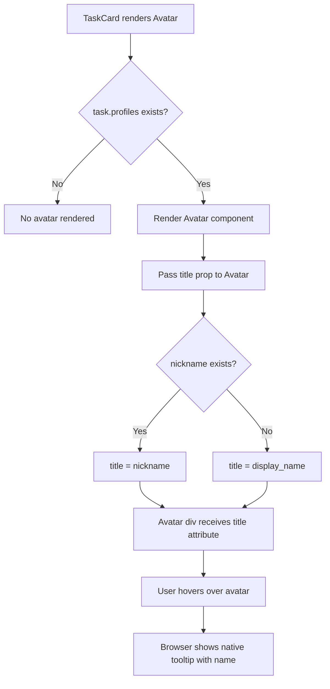

# ADR-005: Assignee Tooltip

**Status:** Accepted
**Issue:** #25
**Date:** 2026-02-15

## Context

In the task card UI, each task displays an avatar for the assigned family member. However, users cannot easily identify who is assigned to a task without recognizing the avatar image. This is particularly problematic when:
- Family members have similar-looking avatars
- Users are new to the app and don't recognize avatars yet
- Avatar images are small and hard to distinguish

Users need a way to see the assignee's name when hovering over their avatar in the task card.

## Decision

### Approach: Browser-Native Title Attribute

Use the browser's native `title` attribute on the Avatar component to show a tooltip on hover. This approach was chosen over custom tooltip libraries because:
- Zero additional dependencies
- No extra JavaScript bundle size
- Consistent with browser accessibility standards
- Works out-of-the-box with keyboard focus on supported browsers

### Name Display Priority

The tooltip displays names with the following priority:
1. **Nickname** - if the user has set a nickname, show it (more personal/familiar)
2. **Display name** - fallback to display name if no nickname exists

### Implementation Strategy

The Avatar component already accepts `HTMLAttributes<HTMLDivElement>` via spread props (`...props`), so the `title` attribute passes through automatically without requiring any changes to the Avatar component itself. Only the TaskCard component needs to be updated to pass the `title` prop.

## Consequences

### Positive
- Simple implementation with minimal code changes
- No new dependencies or bundle size increase
- Accessible by default (native browser behavior)
- Consistent hover behavior across all browsers
- Falls back gracefully if title is not provided

### Negative
- Native tooltips have limited styling options (browser-controlled appearance)
- Slight delay before tooltip appears (browser-controlled timing)
- Touch devices don't support hover, so mobile users won't see the tooltip
- Cannot include rich content like images in the tooltip

## Diagram

## Implementation

Key files and changes:
- `components/tasks/task-card.tsx` - Add `title` prop to Avatar component with nickname/display_name fallback
- `__tests__/components/tasks/task-card.test.tsx` - Add unit tests verifying title attribute behavior for nickname, display_name fallback, and no-assignee cases
