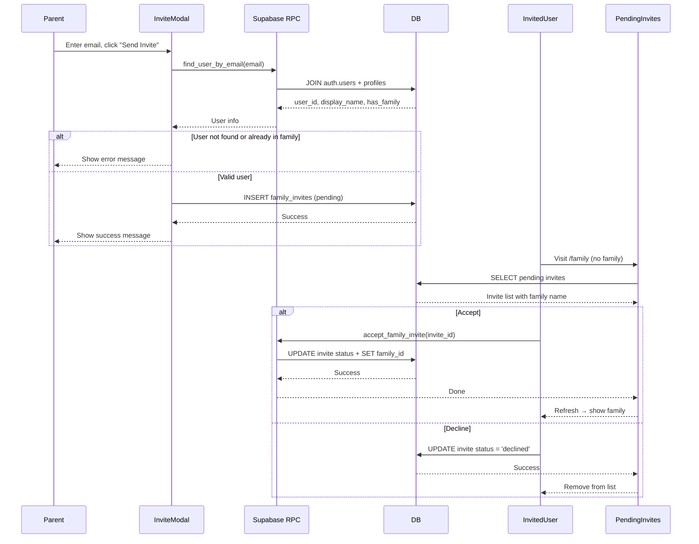

# ADR-006: Invite Existing User to Family by Email

**Status:** Accepted
**Issue:** #6
**Date:** 2026-02-15

## Context

Parents can currently only invite family members via an 8-character invite code or shareable link. This requires out-of-band communication — the parent must copy the code and send it through a separate channel (text, email, etc.). Issue #6 requests the ability to invite an existing user directly by typing their email address within the app.

Since no email service is configured, this is an **in-app invite system**: the parent identifies the target user by email, and the invited user sees a pending invite when they visit the Family page.

Key constraints:
- User emails are stored in `auth.users` (Supabase Auth), not in `profiles`
- We must not expose email addresses through client-side queries
- A user can only belong to one family at a time
- Only parents should be able to send invites

## Decision

### New `family_invites` Table

Create a `family_invites` table that tracks invite lifecycle (pending → accepted/declined). Store `invited_user_id` (resolved server-side) rather than email to avoid exposing emails in the client.

### Secure Email Lookup via RPC

Use a `SECURITY DEFINER` function `find_user_by_email(lookup_email)` that joins `auth.users` with `profiles` to return the user's id, display name, avatar, and whether they already have a family — without exposing the email column to the client.

### Atomic Accept via RPC

Use a `SECURITY DEFINER` function `accept_family_invite(invite_id)` that atomically updates the invite status and sets the user's `family_id` in a single transaction, preventing race conditions.

### Tabbed InviteModal

Extend the existing InviteModal with two tabs: "Share Code" (existing behavior) and "Invite by Email" (new). This preserves the existing invite code flow while adding the new capability.

### PendingInvites on Family Page

Users without a family see pending invites above the "Create Family" form on the Family page. This is the natural location since users without a family will visit `/family` to join or create one.

## Consequences

### Positive
- Parents can invite known users without leaving the app
- Invited users see invites in a natural location (Family page)
- Email addresses stay secure — never exposed to the client
- Atomic accept prevents partial state (invite accepted but family_id not set)
- Existing invite code flow remains unchanged

### Negative
- No push notification — invited users only see invites when they visit the Family page
- Requires the invited user to already have an account (no signup invitation)
- Two RPC functions add server-side complexity
- Partial unique index needed to allow re-inviting after decline

## Alternatives Considered

1. **Store email in `family_invites`**: Simpler but exposes emails via RLS SELECT policies. Rejected for security.
2. **Email notification via edge function**: Would improve discoverability but adds infrastructure complexity. Can be added later.
3. **Show invites on Profile page**: Considered showing on `/me` instead of `/family`, but `/family` is more contextually appropriate for users looking to join a family.

## Diagram

## Implementation

Key files and changes:
- `supabase/migrations/010_family_invites.sql` - New table, RLS policies, `find_user_by_email` and `accept_family_invite` RPC functions
- `lib/types.ts` - Add `family_invites` table type, `FamilyInvite` convenience type, RPC function signatures
- `components/family/invite-modal.tsx` - Add tabbed UI with "Share Code" and "Invite by Email" tabs
- `components/family/pending-invites.tsx` - New component showing pending invites with Accept/Decline buttons
- `components/family/sent-invites.tsx` - New component showing sent invites for parents
- `app/(dashboard)/family/page.tsx` - Integrate PendingInvites (no-family state) and pass new props to InviteModal
