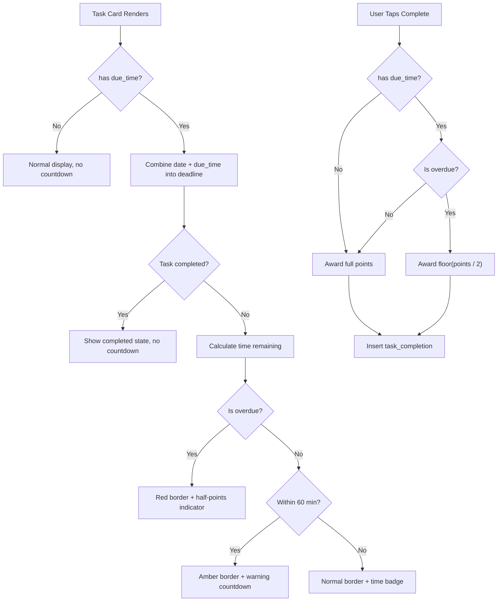

# ADR-007: Time-Sensitive Tasks

**Status:** Accepted
**Issue:** #11
**Date:** 2026-02-15

## Context

Tasks currently have a `due_date` (DATE type) and a `time_of_day` category (morning/afternoon/night/anytime), but no specific due time. Parents want to set precise deadlines like "Take out trash before 7pm" with visual feedback showing time remaining, warnings when deadlines approach, and consequences for late completion (half points).

The system needs to:
- Allow optional time-based deadlines on tasks
- Show a live countdown as deadlines approach
- Visually distinguish warning (< 60 minutes) and overdue states
- Award half points for tasks completed after the deadline
- Work correctly with recurring tasks across different dates

## Decision

### Separate `due_time` Column

Add a `due_time` column of type `time` to the `tasks` table rather than changing `due_date` from DATE to TIMESTAMPTZ. This keeps all existing date-based queries untouched and is fully backward-compatible — a NULL `due_time` means no time constraint, preserving current behavior for all existing tasks.

```sql
ALTER TABLE tasks ADD COLUMN due_time time;
CREATE INDEX idx_tasks_due_time ON tasks(due_time) WHERE due_time IS NOT NULL;
```

No RLS policy changes are needed because existing policies already cover all columns on the `tasks` table. No trigger changes are needed because `points_earned` in `task_completions` is already a pass-through value set at completion time.

### Client-Side Deadline Calculation

Combine `due_date` (or `selectedDate` for recurring tasks) with `due_time` on the client to produce a deadline timestamp. Compare against `new Date()` to determine overdue/warning status. This avoids adding server-side cron jobs or edge functions for what is fundamentally a UI concern.

### Half Points for Late Completion

When a task with a `due_time` is completed after the deadline, award `Math.floor(task.points / 2)` instead of full points. The existing `points_earned` field in `task_completions` already supports arbitrary values, so no schema change is needed.

### 60-Second Countdown Interval

Update the countdown display every 60 seconds via `setInterval`. Minute-level precision is sufficient for household chores and keeps resource usage minimal compared to second-level updates.

### 60-Minute Warning Threshold

Tasks within 60 minutes of their deadline enter a "warning" state with an amber visual treatment. This provides a natural urgency window for household tasks — enough time to act, but close enough to feel pressing.

### Recurring Task Date Handling

For recurring tasks, the deadline is computed from `selectedDate + due_time` (the date the user is viewing) rather than the original `due_date`. This ensures the deadline is always relative to the current day's occurrence of the task.

## Consequences

### Positive
- Backward-compatible — existing tasks without `due_time` behave exactly as before
- No server-side complexity — all countdown and penalty logic runs on the client
- Lightweight schema change — single nullable column with a partial index
- Motivates timely completion through the half-points penalty
- Visual countdown creates urgency without being disruptive (amber warning, red overdue)

### Negative
- Client-side time comparison depends on the user's device clock being reasonably accurate
- Half-points penalty is binary (full or half) — no gradual reduction based on how late the completion is
- No server-side enforcement — a modified client could bypass the half-points penalty by sending full points
- 60-second interval means the display can be up to 59 seconds behind real time
- No push notifications — users must have the app open to see countdown warnings

## Alternatives Considered

1. **Change `due_date` to TIMESTAMPTZ**: Would combine date and time into one column, but breaks all existing date-only queries and comparisons. Every query filtering by date would need `::date` casts. Rejected for excessive migration risk.

2. **Server-side deadline enforcement via database trigger**: A trigger on `task_completions` INSERT could auto-calculate half points. More secure, but adds complexity to the trigger chain and makes the penalty logic harder to debug. The current threat model (family members, not adversaries) doesn't warrant it.

3. **Gradual point reduction based on lateness**: Instead of a flat half-points penalty, reduce points proportionally (e.g., lose 10% per 30 minutes late). More nuanced but harder for kids to understand. A simple "on time = full points, late = half points" rule is clearer and more motivating.

4. **Second-level countdown updates**: More precise but creates unnecessary re-renders every second for a chore app. Minute-level precision is adequate and uses fewer resources.

## Diagram



## Implementation

Key files and changes:
- `supabase/migrations/011_time_sensitive_tasks.sql` - Add `due_time` column and partial index
- `lib/types.ts` - Add `due_time: string | null` to tasks Row, Insert, and Update types
- `lib/utils.ts` - Add time utility functions: `combineDateAndTime`, `formatTime`, `getTimeRemaining`, `formatTimeRemaining`, `toTimeString`
- `components/tasks/task-form.tsx` - Add optional `<input type="time">` field for due time
- `components/tasks/task-card.tsx` - Add `useDeadlineStatus` hook with 60s interval, countdown display, warning/overdue border colors, half-points indicator
- `app/(dashboard)/quests/page.tsx` - Pass `due_time` in task create/update, calculate half points on overdue completion
- `__tests__/lib/utils.test.ts` - Unit tests for all new time utility functions
- `__tests__/components/tasks/task-card.test.tsx` - Tests for countdown, warning, overdue, and completed states
- `__tests__/components/tasks/task-form.test.tsx` - Tests for due time input field
- `e2e/quests.spec.ts` - E2E tests for creating tasks with due time
