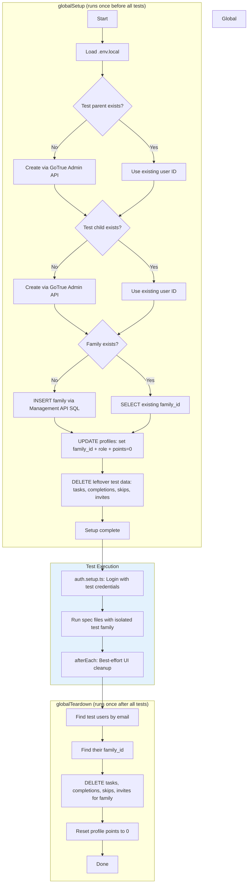

# ADR-008: E2E Test Isolation

**Status:** Accepted
**Issue:** #54
**Date:** 2026-02-15

## Context

E2E tests currently use the real user's Supabase account (`anishaagg@gmail.com`) and its real family data. Tests that create tasks, complete quests, or modify family state pollute the user's actual data. The cleanup mechanism in `e2e/helpers.ts` is UI-based and fragile — if a test fails mid-execution, cleanup doesn't run, leaving stale test data behind.

Specific problems:
- Tests share a real user's account, so test data appears in the production family view
- Per-test cleanup uses UI interactions in `afterEach`, which is skipped when tests fail or time out
- Tables affected include `tasks`, `task_completions`, `task_skips`, `profiles` (points), and `family_invites`
- There is no isolation between test runs — leftover data from a failed run can break subsequent runs

## Decision

### Dedicated Test Accounts via GoTrue Admin API

Create two new Supabase Auth users with test-only emails (`e2e-parent@chore-champions-test.local` and `e2e-child@chore-champions-test.local`) using the GoTrue Admin API. This API accepts `email_confirm: true` to bypass email verification, so login works immediately. The existing `handle_new_user` trigger auto-creates profiles when users are created, so the setup only needs to UPDATE profiles (not INSERT) to set `family_id` and `role`.

This requires adding `SUPABASE_SERVICE_ROLE_KEY` to `.env.local` (gitignored, never committed).

### Supabase Management API for SQL Operations

Use the existing Management API pattern (`POST https://api.supabase.com/v1/projects/{ref}/database/query`) for all direct SQL operations — family creation, profile configuration, and data cleanup. This runs as superuser, bypassing RLS, which is appropriate for test infrastructure.

### Playwright `globalSetup` / `globalTeardown`

Replace the fragile per-test UI cleanup with database-level setup and teardown that runs once per test suite:

- **`globalSetup`**: Creates test users and family (idempotent via SELECT-before-INSERT), configures profiles, and cleans leftover data from any previous failed run
- **`globalTeardown`**: Deletes all test data for the test family and resets points. Wrapped in try/catch so teardown failures don't fail the test run

Existing `afterEach` UI cleanup in spec files remains as a secondary safety net but is no longer the primary mechanism.

### Idempotent Setup via SELECT-or-INSERT

Global setup checks if test users and family already exist before creating them. This makes it safe to run repeatedly, handles partial failures gracefully, and allows the setup to recover from interrupted previous runs.

## Consequences

### Positive
- Real user data is never touched by tests — complete isolation between test and production data
- Database-level cleanup is reliable regardless of test pass/fail status
- Idempotent setup recovers gracefully from partial failures or interrupted runs
- No changes needed to existing spec files — `auth.setup.ts` already reads credentials from env vars
- Single responsibility: `globalSetup` handles all bootstrapping, `globalTeardown` handles all cleanup

### Negative
- Requires `SUPABASE_SERVICE_ROLE_KEY` in the local environment — a sensitive credential that must be managed carefully
- Two API surfaces (Management API for SQL, GoTrue Admin API for users) add complexity to the test infrastructure
- Concurrent test runs sharing the same test family could conflict — acceptable for local dev but CI should serialize
- Test accounts persist in Supabase Auth between runs (only data is cleaned, not users) — intentional for performance but means auth users accumulate if emails change

## Alternatives Considered

1. **Use Supabase local development (Docker)**: Run tests against a local Supabase instance for full isolation. Rejected because the project currently deploys directly to hosted Supabase and adding Docker-based local dev is a larger infrastructure change than the test isolation problem warrants.

2. **Create/delete test users on every run**: Instead of persistent test accounts, create fresh users in setup and delete them in teardown. Rejected because deleting auth users is destructive and the `handle_new_user` trigger + profile creation adds latency. Persistent accounts with data cleanup is faster and simpler.

3. **Transaction-based isolation (BEGIN/ROLLBACK per test)**: Wrap each test in a database transaction and roll back after. Rejected because the app uses Supabase client-side SDK which manages its own connections — there's no way to share a transaction context between the test harness and the app under test.

4. **Separate Supabase project for testing**: Create a dedicated Supabase project used only for E2E tests. Provides the strongest isolation but doubles infrastructure costs and requires maintaining two sets of migrations. Overkill for a family chore app.

## Diagram

## Implementation

Key files and changes:
- `e2e/test-constants.ts` - Central constants for test emails, passwords, family name, and project ref
- `e2e/supabase-admin.ts` - Admin helper with `runSQL()` (Management API) and `ensureAuthUser()` (GoTrue Admin API)
- `e2e/global-setup.ts` - Bootstrap test users, family, profiles; clean leftover data
- `e2e/global-teardown.ts` - Post-run cleanup of all test data with error handling
- `.env.local` - Replace real credentials with dedicated test account credentials; add `SUPABASE_SERVICE_ROLE_KEY`
- `playwright.config.ts` - Add `globalSetup` and `globalTeardown` configuration
