# ADR-009: Increase Test Coverage

**Status:** Accepted
**Issue:** #59
**Date:** 2026-02-17

## Context

Coverage reporting was added in PR #58, revealing that unit test line coverage sits at approximately 50%. Several components and pages have 0% coverage, including layout components (`nav-bar`, `week-picker`), family components (`member-avatar`, `member-filter`, `sent-invites`), and all three dashboard pages (`quests`, `family`, `rewards`). E2E tests cover happy paths but miss flows like dashboard navigation, profile actions, and several quest/family edge cases.

The goal is to raise unit test line coverage as close to 100% as possible and fill E2E gaps — without changing any source files. This is a test-only effort that should improve confidence in the existing codebase before future feature work.

## Decision

### Phased Unit Test Approach (18 test files)

Organize unit test work into four phases ordered by complexity and dependency:

1. **Phase 1 — Uncovered leaf components** (6 new files): Start with small, presentational components that have zero coverage and no complex dependencies. These include `member-avatar` (11 lines), `member-filter` (62 lines), `sent-invites` (58 lines), `nav-bar` (54 lines), `week-picker` (69 lines), and the join landing page (35 lines). Each file targets 100% coverage.

2. **Phase 2 — Dashboard pages** (3 new files): The three main dashboard pages (`quests`, `family`, `rewards`) are the largest untested files. These require extensive Supabase client mocking with chained query builders, following the pattern established in `login.test.tsx` and `invite-modal.test.tsx`. Target ~90%+ coverage due to complexity.

3. **Phase 3 — Other uncovered files** (3 new files): Root landing page, auth callback route, and Supabase client factory modules. These are small but structurally different — the callback route tests HTTP request/response handling, and the client tests verify module-level factory functions.

4. **Phase 4 — Improve existing tests** (6 modified files): Fill coverage gaps in files that already have tests but miss branches. This includes error paths in `task-card` (86% → ~100%), edit mode in `task-form` (90% → ~100%), email invite flow in `invite-modal` (70% → ~100%), and profile actions in `me` page (52% → ~90%+).

### Supabase Mock Pattern

All tests that interact with Supabase use the same mock pattern: mock `@/lib/supabase/client` to return a mock client with chainable query methods (`.from().select().eq()` etc.) that resolve to `{ data, error }` objects. This pattern is already established in the codebase and should be followed consistently across all new test files.

### E2E Test Expansion (5 files)

Add two new E2E spec files and extend three existing ones:

- **`dashboard-nav.spec.ts`** (new): Verifies bottom navigation bar links and active state highlighting across all four dashboard sections.
- **`profile-actions.spec.ts`** (new): Tests profile editing, password change, avatar selection, and sign-out flows.
- **`quests.spec.ts`** (modify): Add point value verification and member assignment tests.
- **`auth.spec.ts`** (modify): Unskip the invalid credentials test and add successful login redirect verification.
- **`family.spec.ts`** (modify): Add the full remove-member confirmation flow.

Both new spec files must be added to the `testMatch` array in `playwright.config.ts` for the parent project, or they will not be discovered by Playwright.

### No Source File Changes

This effort is strictly additive — only test files and the Playwright config are modified. No production source code changes ensures zero regression risk from the test coverage work itself.

## Consequences

### Positive
- Unit line coverage rises from ~50% to ~90%+, providing a strong safety net for future refactoring
- E2E coverage fills gaps in navigation, profile management, and edge cases
- Consistent mock patterns across all tests make future test authoring faster
- No source file changes means zero risk of production regressions
- Phased approach allows incremental progress — each phase is independently valuable

### Negative
- 18 unit test files and 5 E2E files represent significant test code to maintain as the app evolves
- Heavy Supabase mock setup in dashboard page tests is brittle — schema changes require updating mocks across multiple files
- High coverage percentage can create false confidence — tests verify mocked behavior, not real Supabase interactions
- E2E tests for profile actions (password change, sign-out) may be flaky due to auth state transitions
- The phased approach means early phases may need revisiting if later phases reveal shared patterns that should be extracted

## Alternatives Considered

1. **Integration tests with local Supabase**: Run tests against a local Supabase instance (via Docker) instead of mocking. Would provide higher confidence but requires significant infrastructure setup (Docker Compose, seed data, migrations). Rejected as disproportionate to the current goal of increasing coverage metrics and catching component-level regressions.

2. **Snapshot testing for UI components**: Use Jest snapshot tests for presentational components instead of behavioral assertions. Faster to write but snapshots break on any visual change (even intentional ones), creating maintenance burden and noisy diffs. Rejected in favor of behavioral tests that verify user-facing outcomes.

3. **Coverage-driven test generation with AI tools**: Use automated test generation to quickly produce tests for uncovered code. Rejected because generated tests tend to test implementation details rather than behavior, and the resulting tests are harder to maintain. Hand-written tests following established patterns produce more meaningful assertions.

4. **Focus on E2E only, skip unit tests**: E2E tests provide the highest confidence per test. However, they are slow (~30s+ per test), flaky under CI, and poor at isolating failures. A balanced approach with unit tests for component logic and E2E for critical flows provides the best tradeoff of confidence, speed, and debuggability.

## Diagram

```mermaid
flowchart TD
    subgraph Phase1 ["Phase 1: Leaf Components (6 new files)"]
        P1A[member-avatar.test.tsx]
        P1B[member-filter.test.tsx]
        P1C[sent-invites.test.tsx]
        P1D[nav-bar.test.tsx]
        P1E[week-picker.test.tsx]
        P1F[join-landing.test.tsx]
    end

    subgraph Phase2 ["Phase 2: Dashboard Pages (3 new files)"]
        P2A[quests.test.tsx]
        P2B[family.test.tsx]
        P2C[rewards.test.tsx]
    end

    subgraph Phase3 ["Phase 3: Other Files (3 new files)"]
        P3A[root-page.test.tsx]
        P3B[callback.test.ts]
        P3C[supabase-clients.test.ts]
    end

    subgraph Phase4 ["Phase 4: Improve Existing (6 modified files)"]
        P4A[task-card: 86% → 100%]
        P4B[task-form: 90% → 100%]
        P4C[invite-modal: 70% → 100%]
        P4D[in-app-browser-banner: 88% → 100%]
        P4E[underline-input: 82% → 100%]
        P4F[me page: 52% → 90%+]
    end

    subgraph E2E ["E2E Expansion (2 new, 3 modified)"]
        E1[dashboard-nav.spec.ts — new]
        E2[profile-actions.spec.ts — new]
        E3[quests.spec.ts — add point/assign tests]
        E4[auth.spec.ts — unskip + login redirect]
        E5[family.spec.ts — remove member flow]
    end

    Phase1 --> Phase2
    Phase2 --> Phase3
    Phase3 --> Phase4
    Phase4 --> E2E

    E2E --> Result["Unit ≥ 90% line coverage\nAll E2E pass\nNo source changes"]

    style Phase1 fill:#e8f5e9
    style Phase2 fill:#c8e6c9
    style Phase3 fill:#a5d6a7
    style Phase4 fill:#81c784
    style E2E fill:#e3f2fd
    style Result fill:#fff9c4
```

## Implementation

Key files and changes:

**New unit test files (12):**
- `__tests__/components/family/member-avatar.test.tsx` - Avatar initials, role badge, points
- `__tests__/components/family/member-filter.test.tsx` - Filter buttons, selection, onChange callback
- `__tests__/components/family/sent-invites.test.tsx` - Loading, invite list, empty state
- `__tests__/components/layout/nav-bar.test.tsx` - Nav links, active pathname highlighting
- `__tests__/components/layout/week-picker.test.tsx` - Day rendering, navigation, today highlight
- `__tests__/app/auth/join-landing.test.tsx` - Input, uppercase conversion, navigation
- `__tests__/app/dashboard/quests.test.tsx` - Task CRUD, complete/skip/delete, recurring, filters
- `__tests__/app/dashboard/family.test.tsx` - Members, invite modal, remove member, create family
- `__tests__/app/dashboard/rewards.test.tsx` - Leaderboard, podium, empty/loading states
- `__tests__/app/root-page.test.tsx` - Landing page content and links
- `__tests__/app/auth/callback.test.ts` - Code exchange, redirect, error handling
- `__tests__/lib/supabase-clients.test.ts` - Client and server factory functions

**Modified unit test files (6):**
- `__tests__/components/tasks/task-card.test.tsx` - Skip handler, error paths, time-sensitive
- `__tests__/components/tasks/task-form.test.tsx` - Edit mode, time fields, validation errors
- `__tests__/components/family/invite-modal.test.tsx` - Email invite, copy code, role selection
- `__tests__/components/ui/in-app-browser-banner.test.tsx` - Remaining uncovered branches
- `__tests__/components/ui/underline-input.test.tsx` - Remaining uncovered branches
- `__tests__/app/dashboard/me.test.tsx` - Profile edit, password change, logout, avatar

**New E2E files (2):**
- `e2e/dashboard-nav.spec.ts` - Bottom nav navigation and active state
- `e2e/profile-actions.spec.ts` - Display name, password, avatar, sign-out

**Modified E2E files (3):**
- `e2e/quests.spec.ts` - Point value and member assignment tests
- `e2e/auth.spec.ts` - Login redirect and invalid credentials
- `e2e/family.spec.ts` - Remove member confirmation flow

**Config:**
- `playwright.config.ts` - Add `dashboard-nav.spec.ts` and `profile-actions.spec.ts` to parent project `testMatch`
