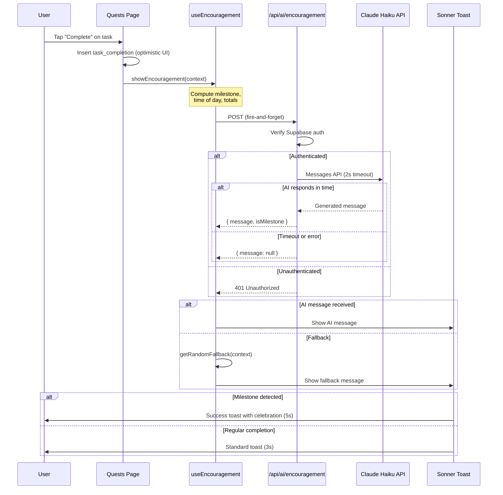

# ADR-010: AI-Powered Smart Encouragement Messages

**Status:** Proposed
**Issue:** #63
**Date:** 2026-02-17

## Context

When kids complete quests in Chore Champions, the only feedback is a visual checkmark and the quest disappearing from the list. There is no celebratory moment or positive reinforcement. Research on gamification and child motivation consistently shows that immediate, varied praise increases engagement and habit formation. Static messages quickly feel repetitive, but hand-writing hundreds of unique messages is impractical.

The app needs a way to deliver short, fun, age-appropriate encouragement messages when a quest is completed. Messages should feel fresh and contextual (referencing the task name, time of day, or point milestones), and the feature must not block or slow down the core completion flow.

## Decision

### Claude Haiku for Message Generation

Use Claude Haiku 4.5 (`claude-haiku-4-5-20251001`) to generate encouragement messages via the Anthropic Messages API. Haiku provides sub-second response times at approximately $0.001 per call, making it suitable for high-frequency, low-stakes text generation. The system prompt constrains output to fun, age-appropriate messages under 30 words.

### Fire-and-Forget Architecture

The encouragement message is fully decoupled from the task completion flow. When a user completes a quest, the completion is inserted into `task_completions` immediately and the UI updates optimistically. A separate, non-blocking call to the encouragement API fires afterward. If the AI call fails or times out, a static fallback message is shown instead. The user never waits for the AI response to see their quest marked complete.

### Raw `fetch` Instead of Anthropic SDK

The API route makes a single POST request to `https://api.anthropic.com/v1/messages` using the standard `fetch` API with a 2-second `AbortController` timeout. This avoids adding the Anthropic SDK as a dependency (~200KB) for what amounts to one HTTP call with a fixed request shape.

### Sonner for Toast Notifications

Use the `sonner` library (3.5KB gzipped) for toast notifications. It is purpose-built for Next.js/React, supports rich content styling, and provides a simple imperative API (`toast()`, `toast.success()`). Regular completions show a standard toast for 3 seconds; milestone achievements show a success-styled toast for 5 seconds.

### Client-Side Milestone Detection

Milestones (point thresholds at 50, 100, 250, 500, 1000 and "all tasks done today") are computed on the client from data already available in the quests page state. This avoids a database migration, additional queries, or server-side milestone tracking. The milestone type is sent to the API route so the AI can reference it in the generated message.

### Static Fallback Messages

A library of approximately 15 categorized static messages (general, points-related, all-done) serves as a fallback when the AI call fails, times out, or is unavailable. The fallback selector tracks the last 5 shown messages via a `useRef` to avoid immediate repeats.

### No Database Migration

No new tables or columns are needed. The encouragement feature is entirely stateless from the database perspective. All context (task title, points earned, total points, completions today) is passed from the client to the API route at request time.

## Consequences

### Positive
- Immediate, varied positive reinforcement increases kid engagement and motivation to complete quests
- Non-blocking architecture means zero impact on the core completion flow — if AI is slow or down, the app works identically
- Contextual messages (referencing the task, time of day, milestones) feel personal without storing any user preferences
- No database migration reduces deployment risk and keeps the schema simple
- Fallback messages ensure the feature always delivers something, even without network connectivity to Anthropic
- Low per-call cost (~$0.001) makes the feature economically viable even at high usage

### Negative
- Adds an external API dependency (Anthropic) — outages or API changes require updating the route
- `ANTHROPIC_API_KEY` must be provisioned as an environment variable in all deployment environments
- No rate limiting in the initial implementation — a user rapidly completing and undoing quests could generate excessive API calls
- AI-generated content is unpredictable by nature — the system prompt constrains it, but there is no content filtering layer beyond what Anthropic provides
- Toast notifications add a new UI pattern to the app that other features may want to reuse, creating implicit coupling to `sonner`

## Alternatives Considered

1. **Static message pool only (no AI)**: Maintain a large bank of pre-written messages and select randomly. Simpler and cheaper, but messages quickly feel repetitive even with 50+ variants. The contextual quality of AI-generated messages (referencing specific task names, milestones, time of day) cannot be replicated with templates alone. Rejected in favor of AI with static fallback as a hybrid approach.

2. **Anthropic SDK instead of raw fetch**: The official `@anthropic-ai/sdk` package provides type safety, automatic retries, and streaming support. However, the encouragement route uses a single, non-streamed API call with a fixed request shape. The SDK would add ~200KB to the server bundle for no functional benefit. Rejected as over-engineering for the use case.

3. **Server-side milestone tracking with database table**: Store milestone achievements in a `milestones` table to avoid recomputation and enable milestone history. This would require a migration, RLS policies, and insert logic. Since milestones are simple threshold checks against data already loaded on the client, the added complexity is not justified. Rejected in favor of client-side computation.

4. **WebSocket or Server-Sent Events for real-time messages**: Push the AI message to the client via a persistent connection instead of a request-response cycle. Would eliminate the need for the client to poll or wait, but adds significant infrastructure complexity (WebSocket server, connection management) for a feature where a simple POST with a 2-second timeout achieves the same user experience. Rejected as disproportionate.

5. **Edge Function instead of API route**: Deploy the encouragement endpoint as a Supabase Edge Function to reduce cold start latency. However, the Next.js API route already runs on the same server as the app with no cold start penalty in production. An Edge Function would also split the codebase across two runtimes. Rejected for unnecessary fragmentation.

## Diagram

## Implementation

Key files and changes:

**New files (3 source, 3 test):**
- `lib/encouragement.ts` — Types (`EncouragementContext`), `FALLBACK_MESSAGES` array, `getRandomFallback()` with repeat avoidance, `detectMilestone()` for point thresholds and all-done detection, `getTimeOfDay()` helper
- `app/api/ai/encouragement/route.ts` — POST handler with Supabase auth check, Anthropic Messages API call with 2-second abort timeout, returns `{ message, isMilestone }` or `{ message: null }`
- `lib/hooks/use-encouragement.ts` — `useEncouragement()` hook that computes context, calls API, tracks recent messages via `useRef`, and triggers `sonner` toasts
- `__tests__/lib/encouragement.test.ts` — Tests for fallback selection, milestone detection, time-of-day logic
- `__tests__/api/encouragement.test.ts` — Tests for auth check, successful AI response, timeout/failure handling
- `__tests__/lib/hooks/use-encouragement.test.ts` — Tests for API integration, toast display, fallback behavior

**Modified files (2):**
- `app/(dashboard)/layout.tsx` — Add `<Toaster position="top-center" richColors />` from `sonner`
- `app/(dashboard)/quests/page.tsx` — Import `useEncouragement`, call `showEncouragement()` after successful task completion

**Dependencies:**
- `npm install sonner` — Toast notification library (3.5KB gzipped)

**Environment:**
- `ANTHROPIC_API_KEY` — Required in `.env.local` and as a GitHub repository secret
