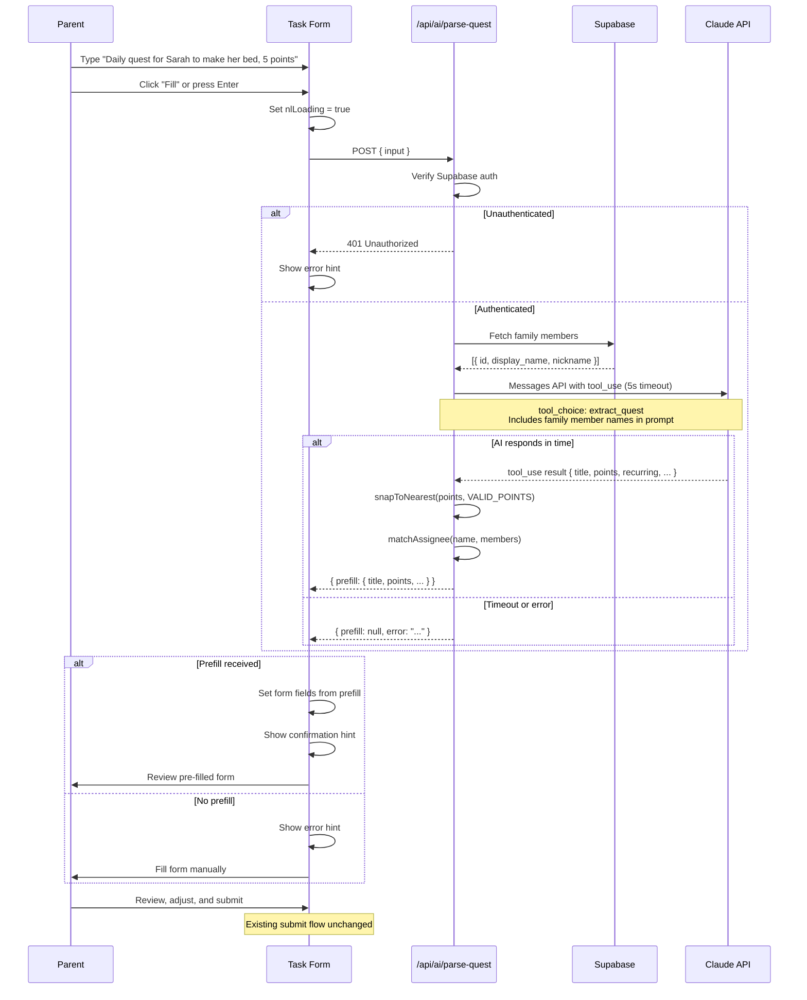

# ADR-011: Natural Language Quest Creation

**Status:** Proposed
**Issue:** #64
**Date:** 2026-02-18

## Context

Parents currently create quests by manually filling out a multi-field form (title, description, points, time of day, recurring flag, assignee). For parents managing multiple children with many quests, this is tedious — especially for straightforward tasks like "Make bed every morning for 5 points." A natural language input would let parents type a plain-English sentence and have the form pre-filled automatically, reducing friction while keeping the existing form as the final confirmation step.

The app already has a pattern for calling the Anthropic Messages API (ADR-010, the encouragement feature), so the infrastructure and conventions for server-side AI calls are established. The key challenge is reliably extracting structured quest data from free-form text and mapping it to the existing form fields and valid values.

## Decision

### Claude `tool_use` for Structured Extraction

Use Claude's `tool_use` capability with `tool_choice: { type: 'tool', name: 'extract_quest' }` to force the model to return structured JSON matching the quest form schema. Unlike free-text parsing or regex extraction, `tool_use` guarantees a deterministic output shape — the model must call the specified tool with the defined parameters, eliminating the need for post-hoc JSON validation or schema coercion.

The tool schema defines fields for title, description, points, time_of_day, recurring, and assigned_to (a name string extracted from the input).

### Server-Side Assignee Matching

The API route fetches the current family's members from Supabase and includes their names in the prompt context. When the AI extracts a name string from the user's input, the server matches it to a family member UUID using a three-tier fallback strategy:

1. **Exact match** — case-insensitive comparison against `display_name` and `nickname`
2. **Prefix match** — input is a prefix of a member's name (e.g., "Sar" matches "Sarah")
3. **Substring match** — input appears anywhere in a member's name

This matching runs server-side where the family member list is already available, avoiding an extra client-side fetch.

### Points Snapped to Valid Enum

Quest points must be one of `[5, 10, 15, 20, 25, 50]`. Rather than rejecting an AI-extracted value like 7, the `snapToNearest` utility finds the closest valid value (7 → 5). This ensures the pre-filled form always has a valid point value regardless of what the model returns.

### 5-Second Timeout

The encouragement feature uses a 2-second timeout because it is non-blocking (fire-and-forget). Natural language quest parsing is a blocking UX interaction — the parent is waiting for the form to fill. A 5-second `AbortController` timeout balances responsiveness against giving the model enough time to respond. On timeout, the form remains empty with an error hint.

### Graceful Degradation

The natural language input is entirely optional. If `ANTHROPIC_API_KEY` is not configured, the AI call fails, or the response times out, the form works exactly as before. An error hint is shown below the NL input, and the parent can fill the form manually. The feature never blocks quest creation.

### No Database Migration

The parsed result is ephemeral — it pre-fills form state in memory and is discarded. The quest is ultimately created through the existing form submission path, which writes to the `tasks` table with no schema changes. No new tables, columns, or RLS policies are needed.

### NL Input Hidden in Edit Mode

The natural language input only appears when creating a new quest. In edit mode, the form fields are already populated, so pre-filling from natural language would overwrite the parent's existing edits. Hiding the input avoids confusion and keeps the edit flow unchanged.

### Raw `fetch` Instead of Anthropic SDK

Following the pattern established in ADR-010, the API route uses a raw `fetch` call to the Anthropic Messages API rather than importing the Anthropic SDK. The request shape is fixed and simple — adding ~200KB of SDK for a single POST call is not justified.

## Consequences

### Positive
- Significantly reduces quest creation time for parents — a single sentence replaces filling 4-6 form fields
- Forced `tool_use` guarantees structured output shape, eliminating fragile text parsing
- Graceful degradation means the feature is zero-risk to the core quest creation flow
- No database migration keeps deployment simple and reversible
- `snapToNearest` and tiered name matching make the feature robust to imprecise AI outputs
- Reuses the API call pattern from ADR-010, keeping the codebase consistent

### Negative
- Adds a second dependency on the Anthropic API — increases exposure to outages or API changes
- 5-second timeout creates a noticeable wait during a blocking UX interaction; users may perceive it as slow
- AI extraction is imperfect — ambiguous inputs ("do the thing for the kid, lots of points") may produce unexpected pre-fills, requiring the parent to correct values
- No rate limiting in the initial implementation — rapid repeated submissions could generate excessive API calls
- The NL input adds UI complexity to the task form component, which is already the most complex form in the app

## Alternatives Considered

1. **Client-side text parsing with regex/heuristics**: Extract quest fields using pattern matching (e.g., look for numbers followed by "points", time-of-day keywords). This would be instant and require no API call, but would be brittle, limited to English patterns, and unable to handle the variety of natural language inputs. A regex parser cannot reliably distinguish "Clean Sarah's room" (task for Sarah) from "Clean the Sarah Lawrence poster" (task about an object). Rejected for poor extraction quality.

2. **Free-text Claude response with JSON parsing**: Ask Claude to return JSON without `tool_use`, then parse the response. This is simpler to implement but the model may return malformed JSON, include markdown fences, or deviate from the expected schema. `tool_use` eliminates these failure modes by construction. Rejected for lower reliability.

3. **Streaming response for perceived speed**: Use streaming to show extracted fields appearing one at a time, reducing perceived latency. This adds significant complexity (partial state management, streaming API handling) for a response that typically completes in 1-2 seconds. The form pre-fill is an atomic operation — showing partial results would be confusing. Rejected as unnecessary complexity.

4. **Dedicated NL creation page instead of inline input**: Create a separate page or modal for natural language quest creation, keeping the existing form untouched. This would be cleaner architecturally but adds navigation friction and splits the creation flow into two paths. An inline input above the existing form is more discoverable and keeps everything in one place. Rejected for worse UX.

5. **Local LLM or embeddings for offline extraction**: Run a small model client-side (e.g., via WebLLM or ONNX) to avoid the API round-trip entirely. Current browser-based models are too large (~100MB+) for a family chore app and extraction quality is significantly lower than Claude. Rejected as impractical for the target audience and device constraints.

## Diagram

## Implementation

Key files and changes:

**New files (2 source, 3 test, 1 E2E):**
- `lib/parse-quest.ts` — `QuestPrefill` and `ParseQuestResponse` types, `snapToNearest()` utility, `matchAssignee()` with exact → prefix → substring fallback, `VALID_POINTS` constant
- `app/api/ai/parse-quest/route.ts` — POST handler with Supabase auth, family member fetch, Claude `tool_use` call with 5-second timeout, point snapping, assignee matching
- `__tests__/lib/parse-quest.test.ts` — Tests for `snapToNearest` and `matchAssignee`
- `__tests__/api/parse-quest.test.ts` — Tests for auth, successful parse, timeout, error cases
- `__tests__/components/tasks/task-form.test.tsx` — Extended with NL input tests (create vs edit mode, pre-fill, error states)
- `e2e/nl-quest-creation.spec.ts` — E2E tests with mocked API route

**Modified files (2):**
- `components/tasks/task-form.tsx` — Add NL text input and "Fill" button above form fields (create mode only), `handleNlParse()` function, loading/error/success states
- `playwright.config.ts` — Add `nl-quest-creation\.spec\.ts` to parent project `testMatch`

**Environment:**
- `ANTHROPIC_API_KEY` — Already required from ADR-010 (encouragement feature)
