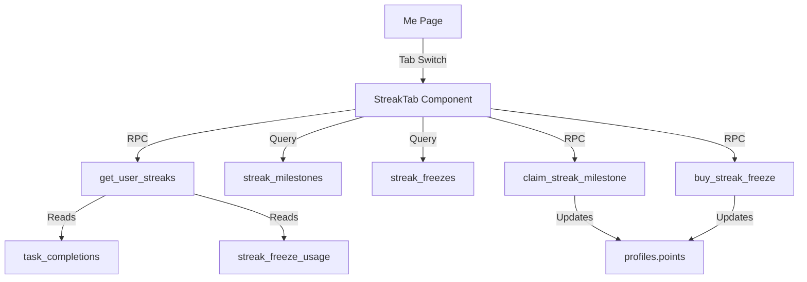

# ADR 013: Streaks — Track Consecutive Days of Task Completion

## Status
Accepted

## Context
Users complete quests daily but have no way to see their consistency. Adding streaks creates a motivation loop: users see their streak grow, earn milestone badges with bonus points, and can buy streak freezes to protect their progress.

## Decision

### Three Streak Types
- **Task streaks**: per daily recurring task, consecutive days completed
- **Perfect Day**: all assigned daily tasks completed
- **Active Day**: at least 1 task completed

### On-Demand RPC Computation
`get_user_streaks` RPC computes streaks from `task_completions` data on each page load. No denormalized streak columns that could go stale.

### Streak Freezes
- Purchasable for 50 points
- Free freezes awarded at 30-day and 100-day milestones
- NOT auto-applied — user chooses when to use them

### Milestone Badges & Bonus Points
| Days | Bonus | Badge |
|------|-------|-------|
| 7 | +50 | Week Warrior |
| 14 | +100 | Fortnight Fighter |
| 30 | +250 | Monthly Master |
| 60 | +500 | Sixty-Day Sage |
| 100 | +1000 | Century Champion |

### UI Placement
Tab switcher (Profile | Streaks) on `/me` page keeps nav clean at 4 items.

## Architecture

## Database Tables
- `streak_freezes` — available/used freeze counts per user
- `streak_milestones` — claimed milestone records (prevents double-awarding)
- `streak_freeze_usage` — log of dates where freezes were applied

## Consequences
- Streaks are computed on-demand, so no stale data issues
- Only daily recurring tasks participate (weekly/one-off too sparse)
- RPC approach means streak computation cost scales with history length
- Milestone claims are idempotent via unique indexes
