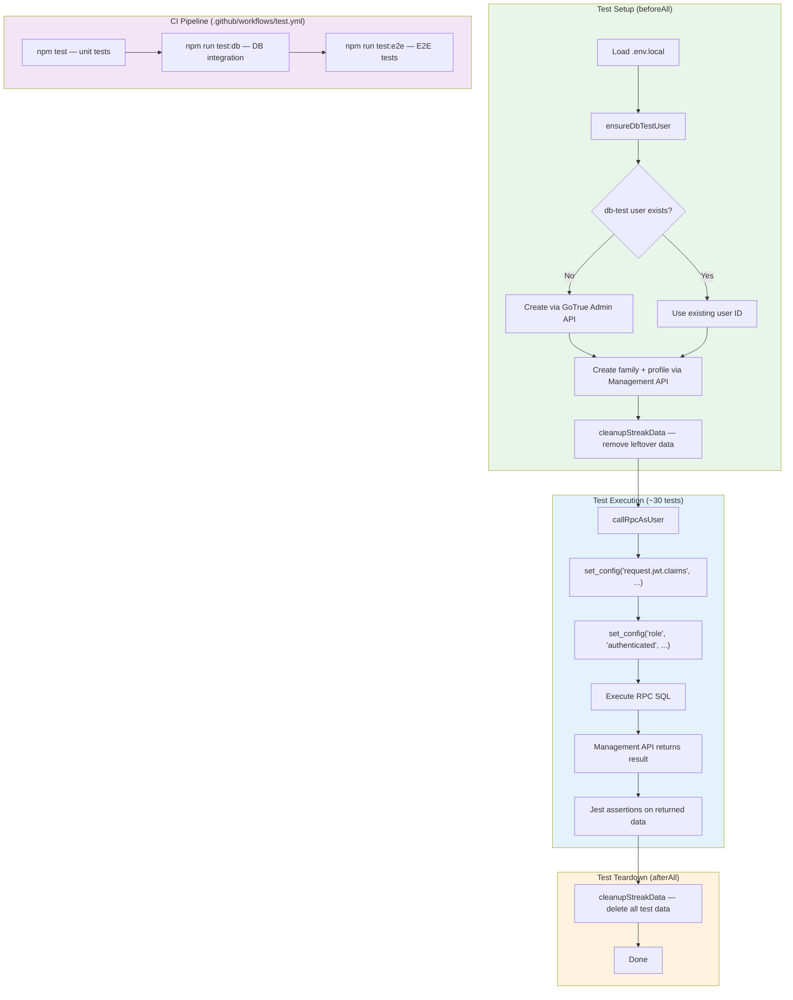

# ADR 014: Database Integration Tests for Streak RPCs

## Status
Proposed

## Context

A `date = text` type mismatch in the `get_user_streaks` RPC (`012_streaks.sql:149`) went undetected through the entire test suite. Unit tests mock the Supabase client, so they never execute real SQL. E2E tests only assert on rendered UI text, so they miss runtime Postgres errors that get swallowed by the client SDK's `{ data: null, error }` pattern (the UI shows an empty state, which looks like "no streaks yet" rather than a failure).

This gap means any bug in RPC SQL — type mismatches, incorrect joins, wrong date arithmetic, RLS policy violations — can ship to production without any test catching it. The streak feature has four RPCs (`get_user_streaks`, `buy_streak_freeze`, `use_streak_freeze`, `claim_streak_milestone`) with non-trivial SQL logic that computes streaks from `task_completions` data, manages freeze inventory, and awards milestone bonuses. These are exactly the kind of functions that need real database execution to validate.

## Decision

### `set_config` + Management API for Authenticated RPC Calls

Postgres's `set_config('request.jwt.claims', '{"sub":"<user-id>"}', true)` simulates `auth.uid()` within a transaction. Combined with `set_config('role', 'authenticated', true)`, this makes RPCs behave as if called by a logged-in user — including RLS policy enforcement.

The Supabase Management API (`POST /v1/projects/{ref}/database/query`) executes arbitrary SQL as superuser and returns only the last statement's result. This means a multi-statement call like:

```sql
SELECT set_config('request.jwt.claims', '{"sub":"user-uuid"}', true);
SELECT set_config('role', 'authenticated', true);
SELECT * FROM get_user_streaks();
```

returns just the RPC output, which is exactly what tests need to assert against.

This approach was verified against our Supabase instance before writing this ADR.

### Separate Jest Configuration (`jest.db.config.ts`)

Database integration tests run in a `node` environment (not `jsdom`) since they make HTTP calls to the Management API and don't render any React components. A separate config keeps them isolated from unit tests:

- `jest.db.config.ts` — `testEnvironment: 'node'`, `testMatch: ['**/__tests__/db/**/*.test.ts']`
- `npm run test:db` — dedicated script so developers can run DB tests independently
- Unit tests (`npm test`) are unaffected and continue to run with `jsdom`

### Test Helpers

Three helper functions in `__tests__/db/helpers.ts`, reusing existing infrastructure:

- **`callRpcAsUser(userId, sql)`** — wraps the `set_config` + SQL pattern into a single Management API call via the existing `runSQL()` from `e2e/supabase-admin.ts`
- **`ensureDbTestUser()`** — creates or retrieves the dedicated test user (`db-test@chore-champions-test.local`) via the existing `ensureAuthUser()` from `e2e/supabase-admin.ts`
- **`cleanupStreakData(userId)`** — deletes streak_milestones, streak_freeze_usage, streak_freezes, task_completions, and tasks for the test user

### Dedicated Test User

A new test account (`db-test@chore-champions-test.local`) is used exclusively for DB integration tests, separate from the E2E test accounts. This prevents data conflicts if DB tests and E2E tests run concurrently.

### Test Coverage (~30 tests across 4 RPCs)

| RPC | Example test cases |
|-----|--------------------|
| `get_user_streaks` | Returns correct streak count, handles gaps, respects freeze usage, type-safe date handling |
| `buy_streak_freeze` | Deducts points, creates freeze record, rejects insufficient points |
| `use_streak_freeze` | Decrements available count, records usage date, rejects when none available |
| `claim_streak_milestone` | Awards bonus points, creates milestone record, idempotent (no double-award) |

### CI Integration

A new job in `.github/workflows/test.yml` runs `npm run test:db` after the unit test job. It requires the same secrets already configured: `SUPABASE_ACCESS_TOKEN` and `SUPABASE_SERVICE_ROLE_KEY`.

## Consequences

### Positive
- Catches SQL-level bugs (type mismatches, incorrect joins, date arithmetic errors) that unit tests and E2E tests miss entirely
- Tests run against the real database with real RLS policies, validating the actual production code path
- Reuses existing infrastructure (`runSQL`, `ensureAuthUser`) — minimal new code needed
- Separate Jest config means DB tests don't slow down the unit test feedback loop
- The `set_config` approach is lightweight — no real JWT tokens, no HTTP server, no Supabase JS client overhead
- Dedicated test user prevents data conflicts with E2E tests

### Negative
- Tests depend on network access to the hosted Supabase instance — no offline execution
- Management API calls add latency (~200-500ms per query) compared to local database tests
- `set_config` simulates auth but doesn't exercise the full JWT validation path (PostgREST layer is bypassed)
- Another test user to manage in the test infrastructure
- Tests can fail due to Supabase service issues unrelated to code changes (flakiness from external dependency)

## Alternatives Considered

1. **Temporarily disable auth checks in RPCs**: Remove `auth.uid()` calls during testing to avoid the `set_config` complexity. Rejected because this tests different code than production, and risks accidentally shipping RPCs without auth checks.

2. **Extract RPC logic into separate SQL functions**: Factor out the business logic (streak calculation, freeze management) into helper functions that don't reference `auth.uid()`, then test those directly. Rejected because it misses the actual production code path — the integration between auth checks and business logic is exactly where the bug occurred.

3. **Use Supabase JS client with real authentication**: Create a real Supabase client, sign in with the test user's credentials via `signInWithPassword`, and call RPCs through the SDK. Rejected because it adds heavier dependencies (Supabase JS client in test infra), requires managing real auth tokens with refresh logic, and is slower than direct SQL via the Management API.

4. **Local Supabase via Docker**: Run a local Supabase stack and test against it. Provides the strongest isolation and fastest execution, but requires Docker infrastructure, local migration management, and seed data scripts. Disproportionate to the current need of testing four RPCs. Could be revisited if the project grows significantly.

## Diagram



## Implementation

Key files and changes:

- `jest.db.config.ts` — Jest config with `node` environment, matching `__tests__/db/**/*.test.ts`
- `package.json` — Add `test:db` script: `jest --config jest.db.config.ts`
- `__tests__/db/helpers.ts` — `callRpcAsUser()`, `ensureDbTestUser()`, `cleanupStreakData()` (imports from `e2e/supabase-admin.ts`)
- `__tests__/db/get-user-streaks.test.ts` — Tests for streak computation, gap handling, freeze integration, date types
- `__tests__/db/buy-streak-freeze.test.ts` — Tests for point deduction, freeze creation, insufficient points
- `__tests__/db/use-streak-freeze.test.ts` — Tests for freeze decrement, usage recording, empty inventory
- `__tests__/db/claim-streak-milestone.test.ts` — Tests for bonus points, milestone records, idempotency
- `.github/workflows/test.yml` — Add `test-db` job with required secrets
